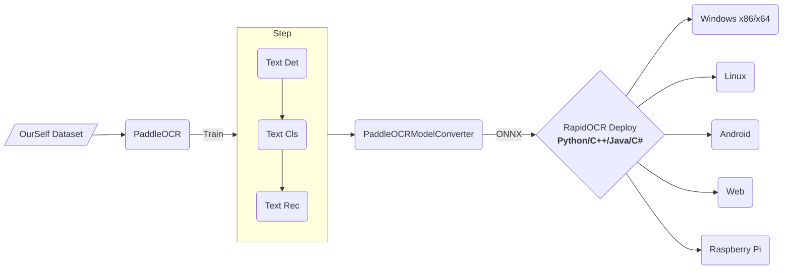

简体中文 | [English](https://github.com/RapidAI/RapidOCR/blob/main/docs/README_en.md)
<div align="center">
  
</div>

# 捷智OCR
*信创级开源OCR - 为世界内容安全贡献力量*

<p align="left">
    <a href="https://huggingface.co/spaces/SWHL/RapidOCRDemo" target="_blank"></a>
    <a href="https://colab.research.google.com/github/RapidAI/RapidOCR/blob/main/assets/RapidOCRDemo.ipynb" target="_blank"></a>
    <a href="https://aistudio.baidu.com/aistudio/projectdetail/4444785?sUid=57084&shared=1&ts=1660896122332" target="_blank"></a><br/>
    <a href="">=3.7,<=3.10-aff.svg"></a>
    <a href=""></a>
    <a href="https://github.com/RapidAI/RapidOCR/graphs/contributors"></a>
    <a href="https://pepy.tech/project/rapidocr_onnxruntime"></a>
    <a href="https://pypi.org/project/rapidocr-onnxruntime/"></a>
    <a href="https://github.com/RapidAI/RapidOCR/stargazers"></a>
    <a href="https://semver.org/"></a>
    <a href='https://rapidocr.readthedocs.io/en/latest/?badge=latest'>
        
    </a>
</p>


<details>
    <summary>目录</summary>

- [捷智OCR](#捷智ocr)
  - [商业支持](#商业支持)
  - [简介](#简介)
  - [文档导航](#文档导航)
  - [近期更新(more)](#近期更新more)
      - [🍜2023-05-22 api update:](#2023-05-22-api-update)
      - [❤2023-05-20 ocrweb update:](#2023-05-20-ocrweb-update)
      - [🌹2023-05-14 ocrweb v0.1.5 update:](#2023-05-14-ocrweb-v015-update)
  - [生态框架](#生态框架)
  - [在线demo](#在线demo)
  - [TODO以及任务认领](#todo以及任务认领)
  - [原始发起者及初创作者](#原始发起者及初创作者)
  - [致谢](#致谢)
  - [赞助](#赞助)
  - [版权声明](#版权声明)
  - [授权](#授权)
  - [加入我们](#加入我们)
  - [示例图](#示例图)
      - [C++/JVM示例图像](#cjvm示例图像)
      - [.Net示例图像](#net示例图像)
      - [多语言示例图像](#多语言示例图像)
</details>

## 商业支持
- 🎉🎉🎉 推出知识星球[RapidAI私享群](https://t.zsxq.com/0duLBZczw)，这里的提问会优先得到回答和支持，也会享受到RapidAI组织后续持续优质的服务，欢迎大家的加入。
- 提供信创平台多架构，包括**Arm/X86/mips(龙芯)/RISC-V**等信创CPU支持，同时兼容**ONNXRuntime/OpenVINO/NCNN**。有意者邮件联系: znsoft@163.com, 请先邮件咨询服务项目，即时回复联系方式。
- 提供国产操作系统（海光、中科方德、麒麟等等）OCR Docker部署服务，有意者 → ✉ liekkaskono@163.com。

## 简介
- 💖目前已知**运行速度最快、支持最广**，完全开源免费并支持离线快速部署的多平台多语言OCR。
- **中文广告**： 欢迎加入我们的QQ群下载模型及测试程序，QQ群号：887298230，2群(755960114)
- **支持的语言**: 默认是中英文，其他语言识别需要自助转换。具体参考[这里](https://github.com/RapidAI/RapidOCR/wiki/support_language)
- **缘起**：百度paddlepaddle工程化不是太好，为了方便大家在各种端上进行ocr推理，我们将它转换为onnx格式，使用`Python/C++/Java/Swift/C#` 将它移植到各个平台。
- **名称来源**： 轻快好省并智能。基于深度学习技术的OCR技术，主打人工智能优势及小模型，以速度为使命，效果为主导。
- **使用**：
  - 如果仓库下已有模型满足要求 → RapidOCR部署使用即可。
  - 不满足要求 → 基于[PaddleOCR](https://github.com/PaddlePaddle/PaddleOCR)在自己数据上微调 → RapidOCR部署。
- 如果该仓库有帮助到你，还请点个小星星⭐呗！

## 文档导航
- [Wiki](https://github.com/RapidAI/RapidOCR/wiki)
  - [自定义识别模型](https://github.com/RapidAI/RapidOCR/wiki/support_language)
  - [ONNXRuntime推理调优指南](https://github.com/RapidAI/RapidOCR/wiki/ONNXRuntime%E6%8E%A8%E7%90%86%E8%B0%83%E4%BC%98%E6%8C%87%E5%8D%97)
  - [RapidOCR调优尝试教程](https://github.com/RapidAI/RapidOCR/wiki/RapidOCR%E8%B0%83%E4%BC%98%E5%B0%9D%E8%AF%95%E6%95%99%E7%A8%8B)
  - [OpenVINO推理](https://github.com/RapidAI/RapidOCR/wiki/openvino%E6%8E%A8%E7%90%86)
  - [config.yaml参数详解](https://github.com/RapidAI/RapidOCR/wiki/config_parameter)
- [Python范例](https://github.com/RapidAI/RapidOCR/blob/main/python/README.md)
- [C++范例(Windows/Linux/macOS)](https://github.com/RapidAI/RapidOCR/blob/main/cpp)
  - [RapidOcrOnnx](https://github.com/RapidAI/RapidOcrOnnx)
  - [RapidOcrNcnn](https://github.com/RapidAI/RapidOcrNcnn)
- [Jvm范例(Java/Kotlin)](https://github.com/RapidAI/RapidOCR/blob/main/jvm)
  - [RapidOcrOnnxJvm](https://github.com/RapidAI/RapidOcrOnnxJvm)
  - [RapidOcrNcnnJvm](https://github.com/RapidAI/RapidOcrNcnnJvm)
- [.Net范例(C#)](https://github.com/RapidAI/RapidOCRCSharp)
- [Android范例](https://github.com/RapidAI/RapidOcrAndroidOnnx)
- 网页版范例
  - [网页版OCR](https://github.com/RapidAI/RapidOCR/blob/main/ocrweb/README.md)
  - [Nuitka打包rapdocr_web](https://github.com/RapidAI/RapidOCR/wiki/Nuitka%E6%89%93%E5%8C%85rapidocr_web%E6%93%8D%E4%BD%9C%E6%96%87%E6%A1%A3)
  - [多语言网页版OCR](https://github.com/RapidAI/RapidOCR/blob/main/ocrweb_multi/README.md)
- [API版](https://github.com/RapidAI/RapidOCR/tree/main/api)
- [版面结构化-RapidStructure](https://github.com/RapidAI/RapidStructure)
  - [含文本的图像方向分类](https://github.com/RapidAI/RapidStructure/blob/main/docs/README_Orientation.md)
  - [版面分析](https://github.com/RapidAI/RapidStructure/blob/main/docs/README_Layout.md)
  - [表格还原](https://github.com/RapidAI/RapidStructure/blob/main/docs/README_Table.md)
- 衍生项目
  - [RapidOCR HTTP服务/win32程序/易语言编写](https://github.com/Physton/RapidOCRServer)
- [垂直项目](https://github.com/RapidAI/RapidOCR/blob/main/docs/related_projects.md)
  - [RapidOCRPDF](https://github.com/RapidAI/RapidOCRPDF)：解析PDF文件
  - [RapidVideOCR](https://github.com/SWHL/RapidVideOCR)：基于RapidOCR，提取视频中的硬字幕
  - [LGPMA_Infer](https://github.com/SWHL/LGPMA_Infer): 表格结构还原 | [博客解读论文和源码](http://t.csdn.cn/QNN3S)
  - [PaperEdge](https://github.com/cvlab-stonybrook/PaperEdge)：文档图像矫正 | [Demo](https://huggingface.co/spaces/SWHL/PaperEdgeDemo)
  - [CTRNet](https://github.com/lcy0604/CTRNet)：图像文字擦除 | [Demo](https://huggingface.co/spaces/SWHL/CTRNetDemo)
- [模型相关](https://github.com/RapidAI/RapidOCR/wiki/%E6%A8%A1%E5%9E%8B%E7%9B%B8%E5%85%B3)
- [常见问题 FAQ](https://github.com/RapidAI/RapidOCR/wiki/FAQ)


## 近期更新([more](https://github.com/RapidAI/RapidOCR/wiki/%E6%9B%B4%E6%96%B0%E6%97%A5%E5%BF%97))
#### 🍜2023-05-22 api update:
- 将API从ocrweb中解耦出来，作为单独模块维护，详情参见[API](https://github.com/RapidAI/RapidOCR/tree/main/api)
- `rapidocr_web>0.1.6`之后，将不支持`pip install rapidocr_web[api]`方式安装，可直接`pip install rapidocr_api`安装使用。
#### ❤2023-05-20 ocrweb update:
- 增加桌面版RapidOCRWeb，详情可参见[RapidOCRWeb桌面版使用教程](https://github.com/RapidAI/RapidOCR/wiki/%5BRapidOCRWeb%5D-%E6%A1%8C%E9%9D%A2%E7%89%88%E4%BD%BF%E7%94%A8%E6%95%99%E7%A8%8B)
- 对仓库文档做了整理，大部分文档放到了[Wiki](https://github.com/RapidAI/RapidOCR/wiki)
#### 🌹2023-05-14 ocrweb v0.1.5 update:
- 增加界面版返回坐标框的返回值([issue #85](https://github.com/RapidAI/RapidOCR/issues/85))
- API模式增加base64格式传入
- 详情参见：[link](https://github.com/RapidAI/RapidOCR/blob/main/ocrweb/README.md)

## 生态框架


## 在线demo
- 自建在线demo
    - 详情参见：[ocrweb/README](https://github.com/RapidAI/RapidOCR/blob/main/ocrweb/README.md)
    - **demo所用模型组合（最优组合）为**:
      ```text
      ch_PP-OCRv3_det + ch_ppocr_mobile_v2.0_cls + ch_PP-OCRv3_rec
      ```
    - **示例图**:
        <div align="center">
            
        </div>
- [Hugging Face Demo](https://huggingface.co/spaces/SWHL/RapidOCRDemo)
  - 该demo依托于Hugging Face的Spaces构建，采用Gradio库搭建。
  - 示例图：
    <div align="center">
        
    </div>

## TODO以及任务认领
- 参见这里：[link](https://github.com/orgs/RapidAI/projects/7)

## 原始发起者及初创作者
<p align="left">
  <a href="https://github.com/RapidAI/RapidOCR/graphs/contributors">
    
  </a>
</p>


## 致谢
- 非常感谢[DeliciaLaniD](https://github.com/DeliciaLaniD)修复ocrweb中扫描动画起始位置错位问题。
- 非常感谢[zhsunlight](https://github.com/zhsunlight)关于参数化调用GPU推理的建议以及细致周到的测试。
- 非常感谢[lzh111222334](https://github.com/lzh111222334)修复python版本下rec前处理部分bug。
- 非常感谢[AutumnSun1996](https://github.com/AutumnSun1996)在[#42](https://github.com/RapidAI/RapidOCR/issues/42)中的建议。
- 非常感谢[DeadWood8](https://github.com/DeadWood8)提供了[Nuitka打包rapidocr_web的操作文档和可执行exe](https://github.com/RapidAI/RapidOCR/wiki/Nuitka%E6%89%93%E5%8C%85rapidocr_web%E6%93%8D%E4%BD%9C%E6%96%87%E6%A1%A3)。
- 非常感谢[Loovelj](https://github.com/Loovelj)指出对文本检测框排序时顺序问题，详情参见[issue 75](https://github.com/RapidAI/RapidOCR/issues/75)。

## 赞助
|赞助者|应用的产品|
|:---:|:---:|
|<a href="https://github.com/cuiliang" title="cuiliang"></a>|<a href="https://getquicker.net/" title="Quicker指尖工具箱"></a>|
|<a href="https://github.com/Eunsolfs" title="Eunsolfs"></a>| - |

- 如果您想要赞助该项目，可直接点击当前页最上面的Sponsor按钮，请写好备注(**您的Github账号名称**)，方便添加到上面赞助列表中。


## 版权声明
- 如果你的产品使用了本仓库中的全部或部分代码、文字或材料
- 请注明出处并包括我们的github url: `https://github.com/RapidAI/RapidOCR`

## 授权
- OCR模型版权归百度所有，其它工程代码版权归本仓库所有者所有。
- 本软件采用Apache 授权方式，欢迎大家贡献代码，提交issue 甚至PR。

## 加入我们
- 微信扫描以下二维码，关注**RapidAI公众号**，回复OCR即可加入RapidOCR微信交流群：
    <div align="center">
        
    </div>

- 可以通过QQ群加入我们：**755960114**，或者用QQ扫描以下二维码:

    <div align="center">
        
    </div>

## 示例图
#### C++/JVM示例图像
<div align="center">
    
</div>

#### .Net示例图像
<div align="center">
    
</div>

#### 多语言示例图像
<div align="center">
    
</div>
