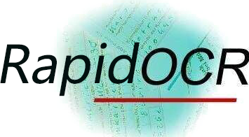
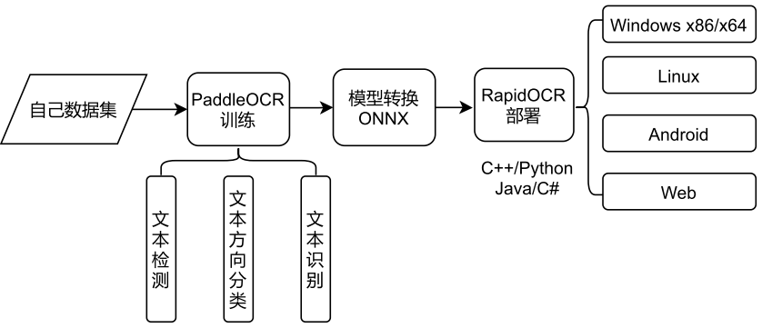
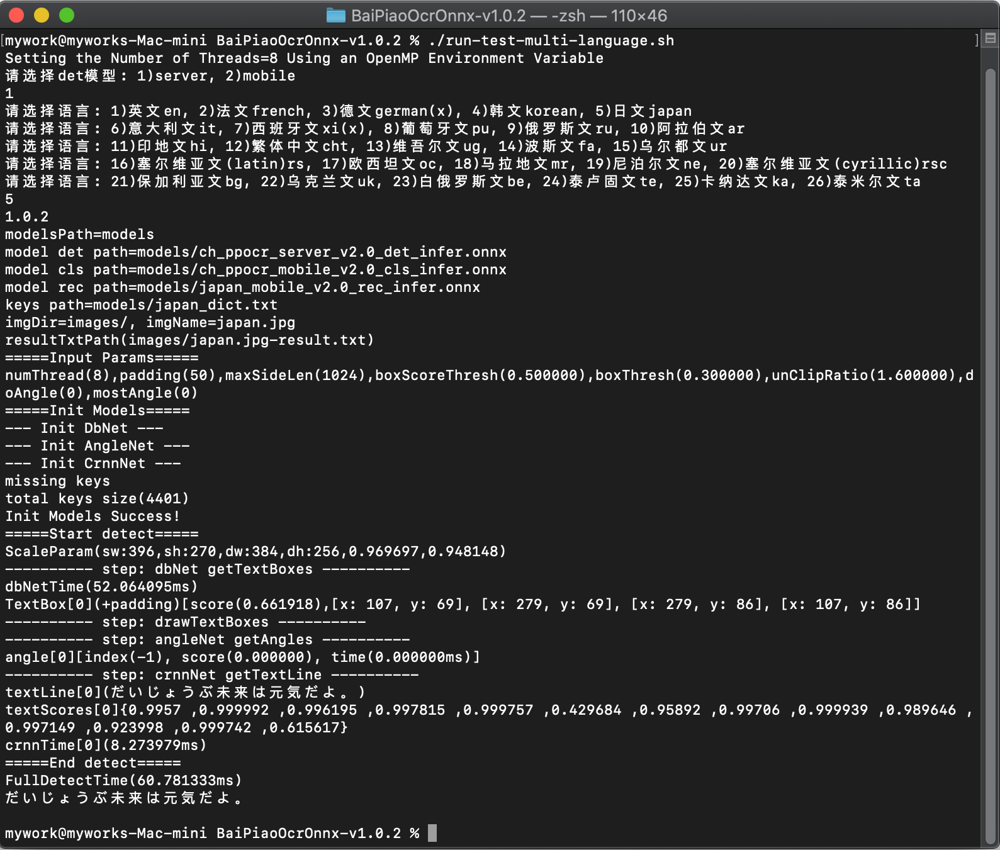

  

# RapidOCR (捷智OCR)

简体中文 | [English](README_en.md)

    
    
    
    
    

    
目录

- [RapidOCR (捷智OCR)](#rapidocr-捷智ocr)
  - [简介](#简介)
  - [近期更新](#近期更新)
      - [🍺2021-11-28 update](#2021-11-28-update)
      - [2021-11-13 update](#2021-11-13-update)
      - [2021-10-27 update](#2021-10-27-update)
      - [2021-09-13 update](#2021-09-13-update)
      - [2021-09-11 update](#2021-09-11-update)
      - [之前更新记录](#之前更新记录)
      - [2021-08-07 update](#2021-08-07-update)
        - [2021-07-17 update](#2021-07-17-update)
        - [2021-07-04 update](#2021-07-04-update)
        - [2021-06-20 update](#2021-06-20-update)
        - [2021-06-10 update](#2021-06-10-update)
        - [2021-06-08 update](#2021-06-08-update)
        - [2021-03-24 update](#2021-03-24-update)
  - [整个框架](#整个框架)
  - [常见问题  FAQ](#常见问题--faq)
  - [SDK 编译状态](#sdk-编译状态)
  - [在线demo](#在线demo)
  - [项目结构](#项目结构)
  - [当前进展](#当前进展)
  - [模型相关](#模型相关)
      - [模型转onnx](#模型转onnx)
  - [原始发起者及初创作者](#原始发起者及初创作者)
  - [版权声明](#版权声明)
  - [授权](#授权)
  - [联系我们](#联系我们)
  - [示例图](#示例图)
      - [C++/JVM示例图像](#cjvm示例图像)
      - [.Net示例图像](#net示例图像)
      - [多语言示例图像](#多语言示例图像)

## 简介
- 💖目前已知**运行速度最快、支持最广**，完全开源免费并支持离线部署的多平台多语言OCR SDK
- **中文广告**： 欢迎加入我们的QQ群下载模型及测试程序，qq群号：887298230
- **缘起**：百度paddlepaddle工程化不是太好，为了方便大家在各种端上进行ocr推理，我们将它转换为onnx格式，使用``python/c++/java/swift/c#`` 将它移植到各个平台。

- **名称来源**： 轻快好省并智能。 基于深度学习技术的OCR技术，主打人工智能优势及小模型，以速度为使命，效果为主导。

- 基于百度的开源PaddleOCR 模型及训练，任何人可以使用本推理库，也可以根据自己的需求使用百度的paddlepaddle框架进行模型优化。

## 近期更新
#### 🍺2021-11-28 update
- 更新[ocrweb](http://rapidocr.51pda.cn:9003/)部分
  - 添加显示各个阶段处理时间
  - 更新说明文档
  - 更换文本检测模型为`ch_PP-OCRv2_det_infer.onnx`,推理更快，更准

#### 2021-11-13 update
- 添加python版本中文本检测和识别可调节的超参数，主要有`box_thresh|unclip_ratio|text_score`，详情见[参数调节](python/README.md#相关调节参数)
- 将文本识别中字典位置以参数方式给出，便于灵活配置，详情见[keys_path](python/rapidOCR.sh)

#### 2021-10-27 update
- 添加使用onnxruntime-gpu版推理的代码（不过gpu版本的onnxruntime不太好用，按照[官方教程](https://onnxruntime.ai/docs/execution-providers/CUDA-ExecutionProvider.html)配置，感觉没有调用起来GPU）
- 具体使用步骤参见: [onnxruntime-gpu推理配置](python/README.md)

#### 2021-09-13 update
- 添加基于`python`的whl文件，便于使用，详情参见`release/python_sdk`

#### 2021-09-11 update
- 添加PP-OCRv2新增模型onnx版本
  - 使用方法推理代码不变，直接替换对应模型即可。
- 经过在自有测试集上评测：
  - PP-OCRv2检测模型效果有大幅度提升，模型大小没变。
  - PP-OCRv2识别模型效果无明显提升，模型大小增加了3.58M。
- 模型上传到[百度网盘 提取码：30jv](https://pan.baidu.com/s/1qkqWK4wRdMjqGGbzR-FyWg)

#### 之前更新记录

    
点击查看

#### 2021-08-07 update
- 现在正在做的
  - [ ] PP-Structure 表格结构和cell坐标预测 正在整理中

- 之前做的,未完成的，欢迎提PR
  - [ ] 打Dokcer镜像
  - [x] 尝试onnxruntime-gpu推理

##### 2021-07-17 update
- 完善README文档
- 增加**英文、数字识别**onnx模型，具体参见`python/en_number_ppocr_mobile_v2_rec`，用法同其他
- 整理一下[模型转onnx](#模型转onnx)

##### 2021-07-04 update
- 目前仓库下的python程序已经可以在树莓派4B上，成功运行，详细信息请进群，询问群主
- 更新整体结构图，添加树莓派的支持

##### 2021-06-20 update
- 优化ocrweb中识别结果显示，同时添加识别动图演示
- 更新`datasets`目录，添加一些常用数据库链接(搬运一下^-^)
- 更新[FAQ](./FAQ.md)

##### 2021-06-10 update
- 添加server版文本识别模型，详情见[提取码：30jv](https://pan.baidu.com/s/1qkqWK4wRdMjqGGbzR-FyWg)

##### 2021-06-08 update
- 整理仓库，统一模型下载路径
- 完善相关说明文档

##### 2021-03-24 update
- 新模型已经完全兼容ONNXRuntime 1.7 或更高版本。 特别感谢：@Channingss
- 新版onnxruntime比1.6.0 性能提升40%以上。

## 整个框架

    

## 常见问题  [FAQ](FAQ.md)

## SDK 编译状态
鉴于ubuntu用户都是商业用户，也有编译能力，暂不提供预编译包使用，可自行编译。

| 平台            | 编译状态 |   提供状态 |
| --------------- | -------- | -------- |
| Windows x86/x64 |          |  [下载链接](https://github.com/RapidAI/RapidOCR/releases) |
| Linux x64       |   |  暂不提供，自行编译 |

## [在线demo](http://rapidocr.51pda.cn:9003/)
- **说明**: 本在线demo不存储小伙伴们上传测试的任何图像数据
- **demo所用模型组合为**: `server det` + `mobile cls` + `mobile rec`
- **示例图**:
    

        
    

## 项目结构

    
(点击展开)

    RapidOCR
    ├── android             # 安卓工程目录
    ├── api4cpp             # c语言跨平台接口库源码目录，直接用根下的CMakelists.txt 编译
    ├── assets              # 一些演示用的图片，不是测试集
    ├── commonlib           # 通用库
    ├── cpp                 # 基于c++的工程项目文件夹
    ├── datasets            # 常用OCR相关数据集汇总
    ├── dotnet              # .Net程序目录
    ├── FAQ.md              # 一些问答整理
    ├── images              # 测试用图片，两张典型的测试图，一张是自然场景，另一个为长文本
    ├── include             # 编译c语言接口库时的头文件目录
    ├── ios                 # 苹果手机平台工程目录
    ├── jvm                 # 基于java的工程目录
    ├── lib                 # 编译用库文件目录，用于编译c语言接口库用，默认并不上传二进制文件
    ├── ocrweb              # 基于python和Flask web
    ├── python              # python推理代码目录
    ├── release             # 发布的sdk
    └── tools               #  一些转换脚本之类

## 当前进展
- [x] C++范例(Windows/Linux/macOS): [demo](./cpp)
- [x] Jvm范例(Java/Kotlin): [demo](./jvm)
- [x] .Net范例(C#): [demo](./dotnet)
- [x] Android范例: [demo](./android)
- [x] python范例: [demo](./python)
- [ ] IOS范例: 等待有缘人贡献代码
- [ ] 依据python版本重写C++推理代码，以提升推理效果，并增加对gif/tga/webp 格式图片的支持

## 模型相关
- 可以直接下载使用的模型 (百度云下载链接：[提取码：30jv](https://pan.baidu.com/s/1qkqWK4wRdMjqGGbzR-FyWg)） 或者 [Google Drive](https://drive.google.com/drive/folders/1x_a9KpCo_1blxH1xFOfgKVkw1HYRVywY?usp=sharing)

|模型名称|模型简介|模型大小|备注|
|:---:|:---:|:---:|:---:|
|⭐ ch_PP-OCRv2_det_infer.onnx|轻量文本检测模型|2.23M|较v1轻量检测，精度有较大提升|
|⭐ ch_PP-OCRv2_rec_infer.onnx|轻量文本识别模型|7.79M||
|||||
|ch_ppocr_mobile_v2.0_det_infer.onnx|轻量文本检测模型|2.23M|PP-OCRv1|
|ch_ppocr_mobile_v2.0_cls_infer.onnx|轻量文本方向分类模型|571KB|PP-OCRv1|
|ch_ppocr_mobile_v2.0_rec_infer.onnx|轻量文本识别模型|4.21M|PP-OCRv1|
|||||
|ch_ppocr_server_v2.0_det_infer.onnx|服务器版文本检测模型|46.60M|PP-OCRv1|
|ch_ppocr_server_v2.0_rec_infer.onnx|服务器版文本识别模型|106M|PP-OCRv1|
|||||
|japan_rec_crnn.onnx|轻量日语识别模型|3.38M|PP-OCRv1|
|en_number_mobile_v2.0_rec_infer.onnx|轻量英文和数字识别模型|1.79M|PP-OCRv1|

#### 模型转onnx
  - [手把手教你使用ONNXRunTime部署PP-OCR](https://aistudio.baidu.com/aistudio/projectdetail/1479970?channelType=0&channel=0) by @Channingss
  - [✧✧PaddleOCRModelConverter](https://github.com/RapidAI/PaddleOCRModelConverter) by @[SWHL](https://github.com/SWHL)
  - [Paddle2OnnxConvertor](https://github.com/RapidAI/Paddle2OnnxConvertor) by @[benjaminwan](https://github.com/benjaminwan)

## 原始发起者及初创作者
- [benjaminwan](https://github.com/benjaminwan)
- [znsoftm](https://github.com/znsoftm)

## 版权声明
- 如果你的产品使用了本仓库中的全部或部分代码、文字或材料
- 请注明出处并包括我们的github url: `https://github.com/RapidAI/RapidOCR`

## 授权
- OCR模型版权归百度所有，其它工程代码版权归本仓库所有者所有。
- 本软件采用LGPL 授权方式，欢迎大家贡献代码，提交issue 甚至pr.

## 联系我们
- 您可以通过QQ群联系到我们：**887298230**
- 群号搜索不到时，请直接点此[**链接**](https://jq.qq.com/?_wv=1027&k=P9b3olx6)，找到组织
- 用QQ扫描以下二维码:

    

        
    

## 示例图
#### C++/JVM示例图像

    

#### .Net示例图像

    

#### 多语言示例图像

    

