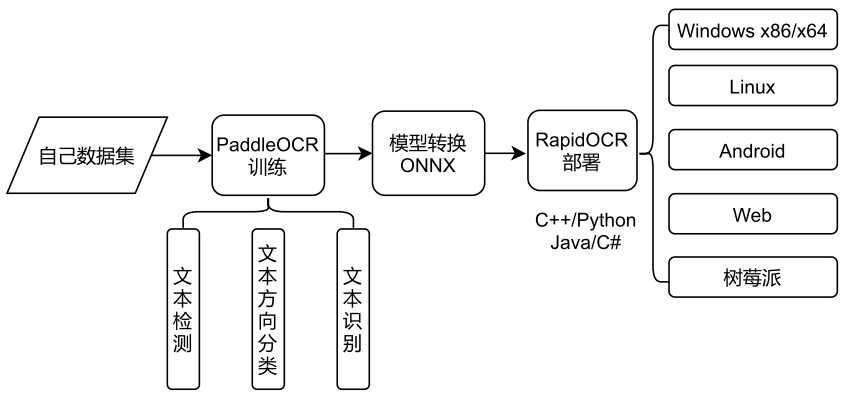

  

# RapidOCR (捷智OCR)

简体中文 | [English](./docs/README_en.md)

    
    
    
    
    
    

    
目录

- [RapidOCR (捷智OCR)](#rapidocr-捷智ocr)
  - [简介](#简介)
  - [近期更新(more)](#近期更新more)
      - [🎧2022-07-10 update:](#2022-07-10-update)
      - [✨2022-07-07 update:](#2022-07-07-update)
  - [生态框架](#生态框架)
  - [相关项目](#相关项目)
  - [常见问题  FAQ](#常见问题--faq)
  - [SDK 编译状态](#sdk-编译状态)
  - [在线demo](#在线demo)
  - [项目结构](#项目结构)
  - [当前进展](#当前进展)
  - [模型相关](#模型相关)
    - [各个版本ONNX模型效果对比](#各个版本onnx模型效果对比)
      - [文本检测模型(仅供参考)](#文本检测模型仅供参考)
      - [文本识别模型(仅供参考)](#文本识别模型仅供参考)
      - [模型转onnx](#模型转onnx)
  - [原始发起者及初创作者](#原始发起者及初创作者)
  - [致谢](#致谢)
  - [赞助](#赞助)
  - [版权声明](#版权声明)
  - [授权](#授权)
  - [联系我们](#联系我们)
  - [示例图](#示例图)
      - [C++/JVM示例图像](#cjvm示例图像)
      - [.Net示例图像](#net示例图像)
      - [多语言示例图像](#多语言示例图像)

## 简介
- 💖目前已知**运行速度最快、支持最广**，完全开源免费并支持离线部署的多平台多语言OCR SDK
- **中文广告**： 欢迎加入我们的QQ群下载模型及测试程序，qq群号：887298230
- **缘起**：百度paddlepaddle工程化不是太好，为了方便大家在各种端上进行ocr推理，我们将它转换为onnx格式，使用`Python/C++/Java/Swift/C#` 将它移植到各个平台。

- **名称来源**： 轻快好省并智能。 基于深度学习技术的OCR技术，主打人工智能优势及小模型，以速度为使命，效果为主导。

- 基于百度的开源PaddleOCR 模型及训练，任何人可以使用本推理库，也可以根据自己的需求使用百度的paddlepaddle框架进行模型优化。

## 近期更新([more](./docs/change_log.md))
#### 🎧2022-07-10 update:
- 添加onnxruntime-gpu的测试情况→[link](./python/README.md#onnxruntime-gpu版推理配置)
- 添加benchamark测试集 → [link](./images/README.md)
- 添加自动发布whl包的actions，当修改`python/rapidocr_onnxruntime`下代码时，会自动更新发布whl包。具体使用方法参见[Whl README](./docs/doc_whl_en.md)

#### ✨2022-07-07 update:
- 修复python版中v3 rec推理bug，并将v3 rec与v2 rec合并为同一套推理代码，更加简洁和方便
- 添加python模块下的单元测试
- 该页面添加[致谢模块](#致谢)，感谢为这个项目作出贡献的小伙伴。

## 生态框架

    

## 相关项目
- [RapidVideOCR](https://github.com/SWHL/RapidVideOCR)：基于RapidOCR，提取视频中的硬字幕
- [LGPMA_Infer](https://github.com/SWHL/LGPMA_Infer): 表格结构还原 | [博客解读论文和源码](https://blog.csdn.net/shiwanghualuo/article/details/125047732)

## 常见问题  [FAQ](./docs/FAQ.md)

## SDK 编译状态
鉴于ubuntu用户都是商业用户，也有编译能力，暂不提供预编译包使用，可自行编译。

| 平台            | 编译状态 |   提供状态 |
| --------------- | -------- | -------- |
| Windows x86/x64 |          |  [下载链接](https://github.com/RapidAI/RapidOCR/releases) |
| Linux x64       |   |  暂不提供，自行编译 |

## [在线demo](http://rapidocr.51pda.cn:9003/)
- **说明**: 本在线demo不存储小伙伴们上传测试的任何图像数据
- **demo所用模型组合（最优组合）为**: `ch_PP-OCRv3_det + ch_ppocr_mobile_v2.0_cls + ch_PP-OCRv3_rec`
- **运行机器配置**: `4核 AMD EPYC 7K62 48-Core Processor `
- **示例图**:
    

        
    

## 项目结构

    
(点击展开)

    RapidOCR
    ├── android             # 安卓工程目录
    ├── api4cpp             # c语言跨平台接口库源码目录，直接用根下的CMakelists.txt 编译
    ├── assets              # 一些演示用的图片，不是测试集
    ├── commonlib           # 通用库
    ├── cpp                 # 基于c++的工程项目文件夹
    ├── docs                # 相关的一些说明文档
    ├── dotnet              # .Net程序目录
    ├── images              # 测试用图片，典型的测试图，一张是自然场景
    ├── include             # 编译c语言接口库时的头文件目录
    ├── ios                 # 苹果手机平台工程目录
    ├── jvm                 # 基于java的工程目录
    ├── lib                 # 编译用库文件目录，用于编译c语言接口库用，默认并不上传二进制文件
    ├── ocrweb              # 基于python和Flask web
    ├── python              # python推理代码目录
    ├── release             # 发布的sdk
    └── tools               #  一些转换脚本之类

## 当前进展
- [x] C++范例(Windows/Linux/macOS): [demo](./cpp)
- [x] Jvm范例(Java/Kotlin): [demo](./jvm)
- [x] .Net范例(C#): [demo](./dotnet)
- [x] Android范例: [demo](./android)
- [x] python范例: [demo](./python)
- [x] OpenVINO加速版本，进行中
- [ ] IOS范例: 等待有缘人贡献代码
- [ ] 依据python版本重写C++推理代码，以提升推理效果，并增加对gif/tga/webp 格式图片的支持

## 模型相关
- 可以直接下载使用的模型 ([百度网盘](https://pan.baidu.com/s/1PTcgXG2zEgQU6A_A3kGJ3Q?pwd=jhai) | [Google Drive](https://drive.google.com/drive/folders/1x_a9KpCo_1blxH1xFOfgKVkw1HYRVywY?usp=sharing)）

|模型名称|模型简介|模型大小|备注|
|:---:|:---:|:---:|:---:|
|⭐ ch_PP-OCRv3_det_infer.onnx|轻量文本检测模型|2.23M|较v1轻量检测，精度有较大提升 from [PaddleOCR](https://github.com/PaddlePaddle/PaddleOCR/blob/release/2.5/README_ch.md#pp-ocr%E7%B3%BB%E5%88%97%E6%A8%A1%E5%9E%8B%E5%88%97%E8%A1%A8%E6%9B%B4%E6%96%B0%E4%B8%AD)|
|⭐ ch_PP-OCRv2_rec_infer.onnx|轻量文本识别模型|7.79M||

### 各个版本ONNX模型效果对比
#### 文本检测模型(仅供参考)
- 测试集：自己构建`中英文(111个，包含卡证、文档和自然图像)`

|                模型                  | infer_Speed(s/img) | precision | recall | hmean  | 模型大小 |
| :---------------------------------: | :----------------: | :-------: | :----: | :----: | :------: |
| ch_ppocr_mobile_v2.0_det_infer.onnx |     0.4345742      |  0.7277   | 0.8413 | 0.7785 |   2.3M   |
|     ch_PP-OCRv2_det_infer.onnx      |     0.5116553      |  0.7817   | 0.8472 | 0.8123 |   2.3M   |
|     ch_PP-OCRv3_det_infer.onnx      |     0.5723512      |  **0.7740**   | **0.8837** | **0.8237** |   2.4M   |

#### 文本识别模型(仅供参考)
- 测试集: 自己构建`中英文(168个)`

|                模型                 | infer_Speed(s/img)   | Score     |    Exact_Match   |   Char_Match | 模型大小 |
| :---------------------------------: | :------------------: | :-------: | :--------------: | :-------------: | :--: |
| ch_ppocr_mobile_v2.0_rec_infer.onnx |       0.0111        |  **0.7287**   |      **0.5595**      |     0.8979      | 4.3M |
|     ch_PP-OCRv2_rec_infer.onnx      |       0.0193        |  0.6955   |      0.4881      |     **0.9029**      | 8.0M |
|     ch_PP-OCRv3_rec_infer.onnx      |       0.0145        |  0.5537   |      0.3274      |     0.7800      |  11M |
| ch_PP-OCRv3_rec_train_student.onnx  |       0.0157        |  0.5537   |      0.3274      |     0.7800      | 11M  |
| ch_PP-OCRv3_rec_train_teacher.onnx  |       0.0140        |  0.5381   |      0.3095      |     0.7667      | 11M  |

#### 模型转onnx
  - [PaddleOCRModelConverter](https://github.com/RapidAI/PaddleOCRModelConverter) by @[SWHL](https://github.com/SWHL)
  - [Paddle2OnnxConvertor](https://github.com/RapidAI/Paddle2OnnxConvertor) by @[benjaminwan](https://github.com/benjaminwan)
  - [手把手教你使用ONNXRunTime部署PP-OCR](https://aistudio.baidu.com/aistudio/projectdetail/1479970?channelType=0&channel=0) by @[Channingss](https://github.com/Channingss)

## 原始发起者及初创作者

    
    
    

## 致谢
- 非常感谢[DeliciaLaniD](https://github.com/DeliciaLaniD)修复ocrweb中扫描动画起始位置错位问题。
- 非常感谢[zhsunlight](https://github.com/zhsunlight)关于参数化调用GPU推理的建议以及细致周到的测试。
- 非常感谢[lzh111222334](https://github.com/lzh111222334)修复python版本下rec前处理部分bug。

## 赞助
|赞助者|应用的产品|
|:---:|:---:|
|||

- 如果您想要赞助该项目，可直接点击当前页最上面的Sponsor按钮，请写好备注，方便添加到上面赞助列表中。

## 版权声明
- 如果你的产品使用了本仓库中的全部或部分代码、文字或材料
- 请注明出处并包括我们的github url: `https://github.com/RapidAI/RapidOCR`

## 授权
- OCR模型版权归百度所有，其它工程代码版权归本仓库所有者所有。
- 本软件采用Apache 授权方式，欢迎大家贡献代码，提交issue 甚至pr.

## 联系我们
- 您可以通过QQ群联系到我们：**887298230**
- 群号搜索不到时，请直接点此[**链接**](https://jq.qq.com/?_wv=1027&k=P9b3olx6)，找到组织
- 用QQ扫描以下二维码:

    

        
    

## 示例图
#### C++/JVM示例图像

    

#### .Net示例图像

    

#### 多语言示例图像

    

