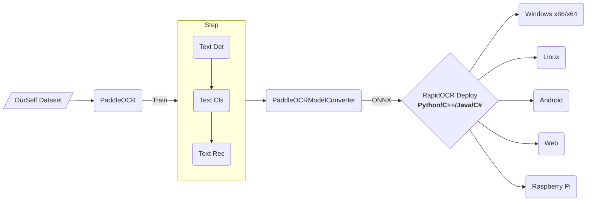

[简体中文](https://github.com/RapidAI/RapidOCR/blob/main/docs/README_zh.md) | English
<div align="center">
  
</div>

*Open source OCR for the security of the digital world*

<p align="left">
    <a href="https://huggingface.co/spaces/SWHL/RapidOCRDemo" target="_blank"></a>
    <a href="https://www.modelscope.cn/studios/liekkas/RapidOCRDemo/summary" target="_blank"></a>
    <a href="https://colab.research.google.com/github/RapidAI/RapidOCR/blob/main/assets/RapidOCRDemo.ipynb" target="_blank"></a>
    <a href="https://aistudio.baidu.com/aistudio/projectdetail/4444785?sUid=57084&shared=1&ts=1660896122332" target="_blank"></a><br/>
    <a href="">=3.6,<3.12-aff.svg"></a>
    <a href=""></a>
    <a href="https://github.com/RapidAI/RapidOCR/graphs/contributors"></a>
    <a href="https://pepy.tech/project/rapidocr_onnxruntime"></a>
    <a href="https://pypi.org/project/rapidocr-onnxruntime/"></a>
    <a href="https://github.com/RapidAI/RapidOCR/stargazers"></a>
    <a href='https://rapidocr.readthedocs.io/en/latest/?badge=latest'>
        
    <a href="https://semver.org/"></a>
    </a>
    <a href="https://github.com/psf/black"></a>
</p>

<details>
    <summary>Contents</summary>

- [Introduction](#introduction)
- [Recent News](#recent-news)
- [Navigation](#navigation)
- [Overall Framework](#overall-framework)
- [Demo](#demo)
- [TODO and Task Claim](#todo-and-task-claim)
- [Original initiator and start-up author](#original-initiator-and-start-up-author)
- [Acknowledgements](#acknowledgements)
- [Sponsor](#sponsor)
- [Authorization](#authorization)
- [Join us](#join-us)
- [Demo](#demo-1)
    - [Demonstration with C++/JVM](#demonstration-with-cjvm)
    - [Demonstration with .Net](#demonstration-with-net)
    - [Demonstratioin with multi\_language](#demonstratioin-with-multi_language)
</details>


## Introduction
- Completely open source, free and support offline deployment of multi-platform and multi-language OCR.
- **Chinese Advertising**: Welcome to join our QQ group to download the model and test program, QQ group number: 887298230
- **Cause**: Baidu paddlepaddle engineering is not very good, in order to facilitate everyone to perform OCR reasoning on various terminals, we convert it to onnx format, use `Python/C++/Java/Swift/C#` to change It is ported to various platforms.
- **Name Source**: Light, fast, economical and smart. OCR technology based on deep learning technology focuses on artificial intelligence advantages and small models, with speed as the mission and effect as the leading role.
- **Usage**:
  - If the existing model in the repo meets the requirements → RapidOCR deployment can be used.
  - Not meeting requirements → Based on [PaddleOCR](https://github.com/PaddlePaddle/PaddleOCR). Fine-tune your own data → RapidOCR deployment.
-If this repo is helpful to you, please click on a small star ⭐ Bah!

## Recent News
- 2023-08-27:
  - \[Python\] Integrate PaddleOCR v4 model and do [review](https://github.com/RapidAI/RapidOCR/wiki/%E4%B8%8D%E5%90%8C%E7%89%88%E6%9C%AC%E6%A8%A1%E5%9E%8B%E4%B9%8B%E9%97%B4%E6%AF%94%E8%BE%83) of v4 model. The v4-based `rapidocr` package has been updated to `v1.3.0`, for documentation see: [link](https://github.com/RapidAI/RapidOCR/tree/main/python)
  - Sorting out differences in the `rapidocr` version series and optimizing some of the python documentation.

## Navigation
- [Wiki](https://github.com/RapidAI/RapidOCR/wiki)
  - [Support Language](https://github.com/RapidAI/RapidOCR/wiki/support_language)
  - [ONNXRuntime inference optim](https://github.com/RapidAI/RapidOCR/wiki/ONNXRuntime%E6%8E%A8%E7%90%86%E8%B0%83%E4%BC%98%E6%8C%87%E5%8D%97)
  - [RapidOCR Optim](https://github.com/RapidAI/RapidOCR/wiki/RapidOCR%E8%B0%83%E4%BC%98%E5%B0%9D%E8%AF%95%E6%95%99%E7%A8%8B)
  - [config.yaml parameter](https://github.com/RapidAI/RapidOCR/wiki/config_parameter)
- [Python demo](https://github.com/RapidAI/RapidOCR/blob/main/python/README.md)
- [C++ demo(Windows/Linux/macOS)](https://github.com/RapidAI/RapidOCR/blob/main/cpp)
  - [RapidOcrOnnx](https://github.com/RapidAI/RapidOcrOnnx)
  - [RapidOcrNcnn](https://github.com/RapidAI/RapidOcrNcnn)
- [Jvm demo(Java/Kotlin)](https://github.com/RapidAI/RapidOCR/blob/main/jvm)
  - [RapidOcrOnnxJvm](https://github.com/RapidAI/RapidOcrOnnxJvm)
  - [RapidOcrNcnnJvm](https://github.com/RapidAI/RapidOcrNcnnJvm)
- [.Net demo(C#)](https://github.com/RapidAI/RapidOCRCSharp)
- [Android demo](https://github.com/RapidAI/RapidOcrAndroidOnnx)
- [API](https://github.com/RapidAI/RapidOCR/tree/main/api)
- Web demo:
  - [Web OCR](https://github.com/RapidAI/RapidOCR/blob/main/ocrweb/README.md)
  - [Nuitka package rapdocr_web](https://github.com/RapidAI/RapidOCR/wiki/Nuitka%E6%89%93%E5%8C%85rapidocr_web%E6%93%8D%E4%BD%9C%E6%96%87%E6%A1%A3)
  - [Multi Web OCR](https://github.com/RapidAI/RapidOCR/blob/main/ocrweb_multi/README.md)
- [RapidStructure](https://github.com/RapidAI/RapidStructure)
  - [orientation](https://github.com/RapidAI/RapidStructure/blob/main/docs/README_Orientation.md)
  - [layout](https://github.com/RapidAI/RapidStructure/blob/main/docs/README_Layout.md)
  - [table recovery](https://github.com/RapidAI/RapidStructure/blob/main/docs/README_Table.md)
- Derivatives
  - [RapidOCR HTTP service/win32 program/easy language writing](https://github.com/Physton/RapidOCRServer)
- [Related projects](https://github.com/RapidAI/RapidOCR/blob/main/docs/related_projects.md)
  - [RapidOCRPDF](https://github.com/RapidAI/RapidOCRPDF)：extract PDF content.
  - [RapidVideOCR](https://github.com/SWHL/RapidVideOCR): Extract hard subtitles in videos based on RapidOCR
  - [LGPMA_Infer](https://github.com/SWHL/LGPMA_Infer): table structure restoration | [blog interpretation papers and source code](http://t.csdn.cn/QNN3S)
  - [Document Unwarping-PaperEdge](https://github.com/cvlab-stonybrook/PaperEdge) | [Demo](https://huggingface.co/spaces/SWHL/PaperEdgeDemo)
  - [Text Removal-CTRNet](https://github.com/lcy0604/CTRNet) | [Demo](https://huggingface.co/spaces/SWHL/CTRNetDemo)
- Model Convert
   - [PaddleOCRModelConverter](https://github.com/RapidAI/PaddleOCRModelConverter)
   - [Paddle2OnnxConvertor](https://github.com/RapidAI/Paddle2OnnxConvertor)
   - [Teach you to use ONNXRunTime to deploy PP-OCR](https://aistudio.baidu.com/aistudio/projectdetail/1479970?channelType=0&channel=0)
- [About model](https://github.com/RapidAI/RapidOCR/blob/main/docs/models.md)
  - [Model Convert](https://github.com/RapidAI/RapidOCR/blob/main/docs/models.md#模型转换)
  - [Model Download](https://github.com/RapidAI/RapidOCR/blob/main/docs/models.md#模型下载)
- [FAQ](https://github.com/RapidAI/RapidOCR/blob/main/docs/FAQ.md)

## Overall Framework


## Demo
- Online demo
    - For details, please refer to: [ocrweb/README](https://github.com/RapidAI/RapidOCR/blob/main/ocrweb/README.md)
    - The model combination (optimal combination) used for the demo is:
      ``` text
      ch_PP-OCRv3_det + ch_ppocr_mobile_v2.0_cls + ch_PP-OCRv3_rec
      ```
    - **Demo**:
        <div align="center">
            
        </div>
- [Hugging Face Demo](https://huggingface.co/spaces/SWHL/RapidOCRDemo)
  - The demo is built on Hugging Face's Spaces, generated by the Gradio library.
  - Demo:
    <div align="center">
        
    </div>


## TODO and Task Claim
- See here: [link](https://github.com/orgs/RapidAI/projects/7)

## Original initiator and start-up author
<p align="left">
  <a href="https://github.com/RapidAI/RapidOCR/graphs/contributors">
    
  </a>
</p>

## Acknowledgements
- Many thanks to [DeliciaLaniD](https://github.com/DeliciaLaniD) for fixing the misplaced start position of scan animation in ocrweb.
- Many thanks to [zhsunlight](https://github.com/zhsunlight) for the suggestion about parameterized call GPU reasoning and the careful and thoughtful testing.
- Many thanks to [lzh111222334](https://github.com/lzh111222334) for fixing some bugs of rec preprocessing under python version.
- Many thanks to [AutumnSun1996](https://github.com/AutumnSun1996) for the suggestion in the [#42](https://github.com/RapidAI/RapidOCR/issues/42).
- Many thanks to [DeadWood8](https://github.com/DeadWood8) for providing the [document]((https://github.com/RapidAI/RapidOCR/wiki/Nuitka%E6%89%93%E5%8C%85rapidocr_web%E6%93%8D%E4%BD%9C%E6%96%87%E6%A1%A3)) which packages rapidocr_web to exe by Nuitka.
- Many thanks to [Loovelj](https://github.com/Loovelj) for fixing the bug of sorting the text boxes. For details see [issue 75](https://github.com/RapidAI/RapidOCR/issues/75).

## Sponsor

|Sponsor|Applied Products|
|:---:|:---:|
|<a href="https://github.com/cuiliang" title="cuiliang"></a>|<a href="https://getquicker.net/" title="Quicker"></a>|
|<a href="https://github.com/Eunsolfs" title="Eunsolfs"></a>| - |

- If you want to sponsor the project, you can directly click the Sponsor button at the top of the current page, please write a note (e.g. your github account name) to facilitate adding to the sponsorship list above.

## Authorization
- The copyright of the OCR model belongs to Baidu, and the copyright of other engineering codes belongs to the owner of this warehouse.
- This software is licensed under Apache 2.0. You are welcome to contribute code, submit an issue or even PR.
- If you find this project useful in your research, please consider citing:
  ```latex
  @misc{RapidOCR 2021,
      title={{Rapid OCR}: OCR Toolbox},
      author={MindSpore Team},
      howpublished = {\url{https://github.com/RapidAI/RapidOCR}},
      year={2021}
  }
  ```

## Join us
- For international developers, we regard [RapidOCR Disscussions](https://github.com/RapidAI/RapidOCR/discussions) as our international community platform. All ideas and questions can be discussed here in English.

## Demo
#### Demonstration with C++/JVM
<div align="center">
    
</div>

#### Demonstration with .Net
<div align="center">
    
</div>

#### Demonstratioin with multi_language
<div align="center">
    
</div>
