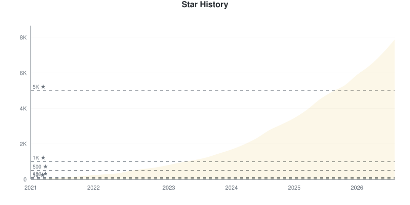
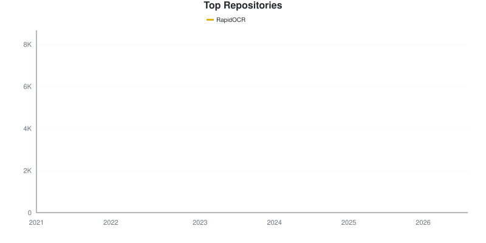
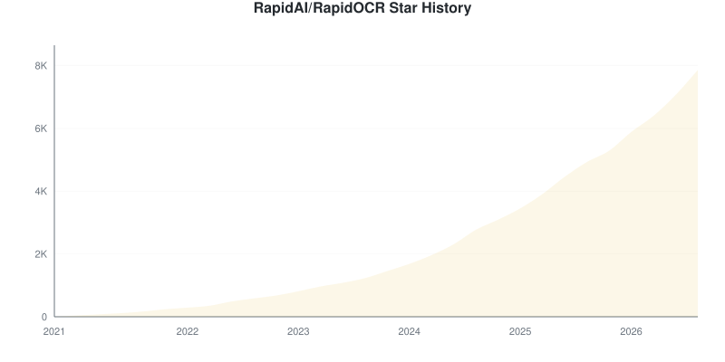
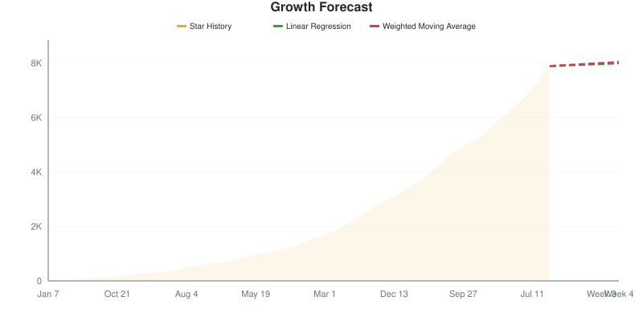

# Star Tracker Report

**2026-08-30** | Total: **7617 stars** | Change: **+3**

> Compared to snapshot from 2026-08-29

## 📈 Star Trend

### By Repository

Individual Repository Charts

#### RapidAI/RapidOCR — 7617 ★ (+3)

## Repositories

| Repositories | Stars | Change | Trend |
|:-----------|------:|-------:|:-----:|
| [RapidAI/RapidOCR](https://github.com/RapidAI/RapidOCR) | 7617 | +3 | ⬆️ |

## Summary

- **Stars gained:** 3
- **Stars lost:** 0
- **Net change:** +3

## 🔮 Growth Forecast

**Aggregate Forecast**

| Method | Week 1 | Week 2 | Week 3 | Week 4 |
|:---|---:|---:|---:|---:|
| Linear Regression | 7641 | 7665 | 7689 | 7713 |
| Weighted Moving Average | 7653 | 7690 | 7726 | 7762 |

### By Repository

RapidAI/RapidOCR

**RapidAI/RapidOCR**

| Method | Week 1 | Week 2 | Week 3 | Week 4 |
|:---|---:|---:|---:|---:|
| Linear Regression | 7641 | 7665 | 7689 | 7713 |
| Weighted Moving Average | 7653 | 7690 | 7726 | 7762 |

---
*Generated by [GitHub Star Tracker](https://github.com/fbuireu/github-star-tracker) on 2026-08-30T02:29:27.988Z*

*Made with 🤘 by [Ferran Buireu](https://github.com/fbuireu)*

