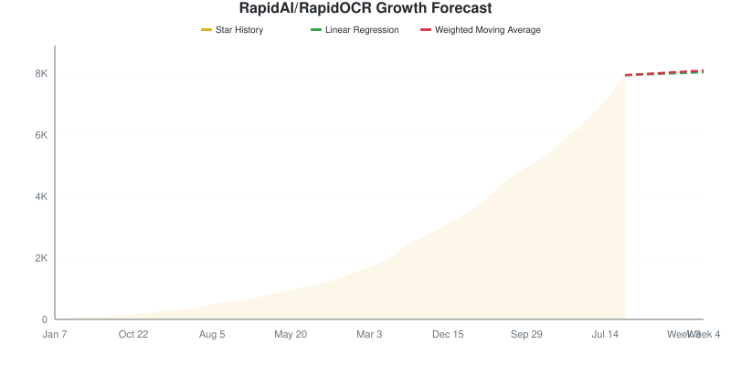

# Star Tracker Report

**2026-09-07** | Total: **7727 stars** | Change: **+10**

> Compared to snapshot from 2026-09-06

## 📈 Star Trend

### By Repository

Individual Repository Charts

#### RapidAI/RapidOCR: 7727 ★ (+10)

## Repositories

| Repositories | Stars | Change | Trend |
|:-----------|------:|-------:|:-----:|
| [RapidAI/RapidOCR](https://github.com/RapidAI/RapidOCR) | 7727 | +10 | ⬆️ |

## Summary

- **Stars gained:** 10
- **Stars lost:** 0
- **Net change:** +10

## 🔮 Growth Forecast

**Aggregate Forecast**

| Method | Week 1 | Week 2 | Week 3 | Week 4 |
|:---|---:|---:|---:|---:|
| Linear Regression | 7751 | 7776 | 7800 | 7824 |
| Weighted Moving Average | 7764 | 7801 | 7837 | 7874 |

### By Repository

RapidAI/RapidOCR

**RapidAI/RapidOCR**

| Method | Week 1 | Week 2 | Week 3 | Week 4 |
|:---|---:|---:|---:|---:|
| Linear Regression | 7751 | 7776 | 7800 | 7824 |
| Weighted Moving Average | 7764 | 7801 | 7837 | 7874 |

---
*Generated by [GitHub Star Tracker](https://github.com/fbuireu/github-star-tracker) on 2026-09-07T01:55:44.672Z*

*Made with 🤘 by [Ferran Buireu](https://github.com/fbuireu)*

