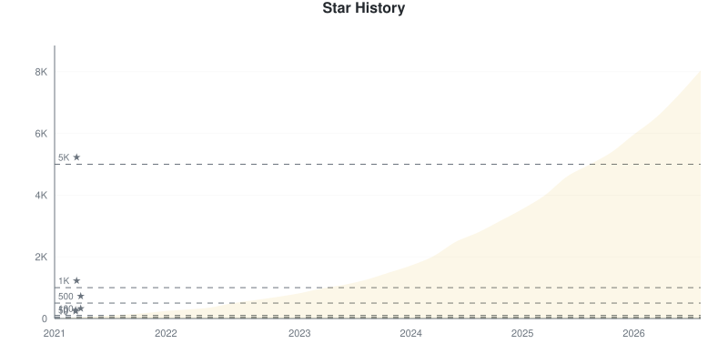
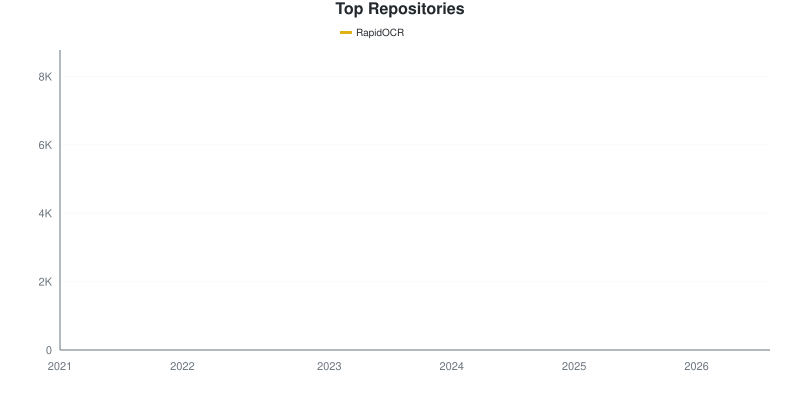
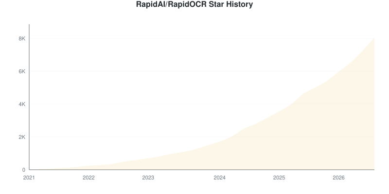
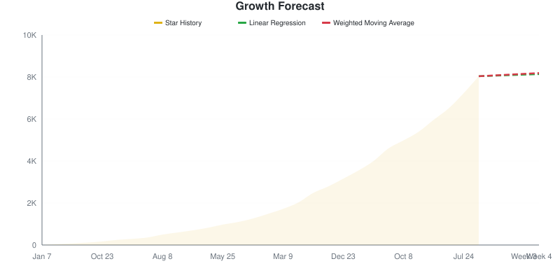
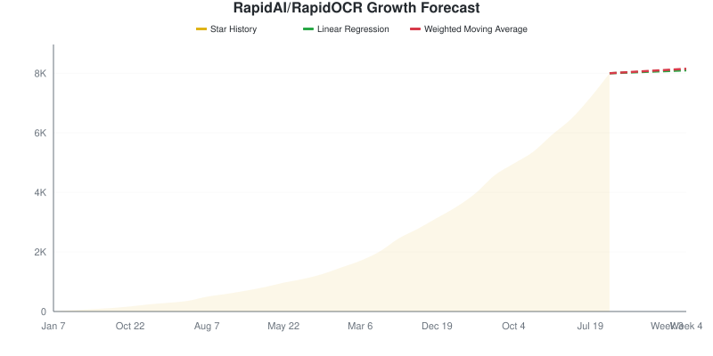

# Star Tracker Report

**2026-10-04** | Total: **8033 stars** | Change: **+4**

> Compared to snapshot from 2026-10-03

## 📈 Star Trend

### By Repository

Individual Repository Charts

#### RapidAI/RapidOCR: 8033 ★ (+4)

## Repositories

| Repositories | Stars | Change | Trend |
|:-----------|------:|-------:|:-----:|
| [RapidAI/RapidOCR](https://github.com/RapidAI/RapidOCR) | 8033 | +4 | ⬆️ |

## Summary

- **Stars gained:** 4
- **Stars lost:** 0
- **Net change:** +4

## 🔮 Growth Forecast

**Aggregate Forecast**

| Method | Week 1 | Week 2 | Week 3 | Week 4 |
|:---|---:|---:|---:|---:|
| Linear Regression | 8058 | 8083 | 8108 | 8132 |
| Weighted Moving Average | 8071 | 8109 | 8147 | 8184 |

### By Repository

RapidAI/RapidOCR

**RapidAI/RapidOCR**

| Method | Week 1 | Week 2 | Week 3 | Week 4 |
|:---|---:|---:|---:|---:|
| Linear Regression | 8058 | 8083 | 8108 | 8132 |
| Weighted Moving Average | 8071 | 8109 | 8147 | 8184 |

---
*Generated by [GitHub Star Tracker](https://github.com/fbuireu/github-star-tracker) on 2026-10-04T03:26:34.190Z*

*Made with 🤘 by [Ferran Buireu](https://github.com/fbuireu)*

