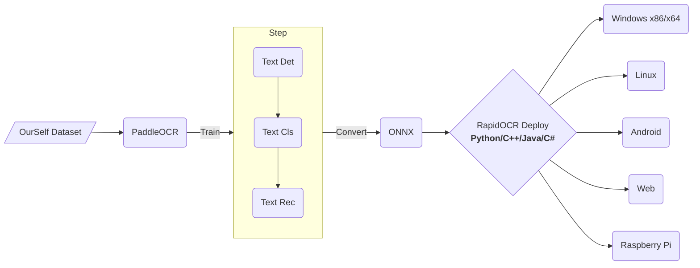

<div align="center">
  
</div>

# RapidOCR (捷智OCR- 信创级开源OCR - 为世界内容安全贡献力量)

简体中文 | [English](./docs/README_en.md)

<p align="left">
    <a href="https://rapidai.deepdatasec.com:9003/" target="_blank"></a>
    <a href="https://huggingface.co/spaces/SWHL/RapidOCRDemo" target="_blank"></a>
    <a href="https://colab.research.google.com/github/RapidAI/RapidOCR/blob/main/assets/RapidOCRDemo.ipynb" target="_blank"></a>
    <a href="https://aistudio.baidu.com/aistudio/projectdetail/4444785?sUid=57084&shared=1&ts=1660896122332" target="_blank"></a><br/>
    <a href="">=3.7,<=3.10-aff.svg"></a>
    <a href=""></a>
    <a href="https://github.com/RapidAI/RapidOCR/graphs/contributors"></a>
    <a href="https://pypi.org/project/rapidocr-onnxruntime/"></a>
    <a href="https://pypi.org/project/rapidocr-onnxruntime/"></a>
    <a href="https://github.com/RapidAI/RapidOCR/stargazers"></a>
</p>


<details>
    <summary>目录</summary>

- [RapidOCR (捷智OCR- 信创级开源OCR - 为世界内容安全贡献力量)](#rapidocr-捷智ocr--信创级开源ocr---为世界内容安全贡献力量)
  - [商业支持](#商业支持)
  - [简介](#简介)
  - [文档导航](#文档导航)
  - [近期更新(more)](#近期更新more)
      - [🎉2023-01-21 update:](#2023-01-21-update)
      - [⚽2022-12-19 update:](#2022-12-19-update)
      - [🤖2022-12-14 update:](#2022-12-14-update)
  - [生态框架](#生态框架)
  - [在线demo](#在线demo)
  - [TODO](#todo)
  - [原始发起者及初创作者](#原始发起者及初创作者)
  - [致谢](#致谢)
  - [赞助](#赞助)
  - [版权声明](#版权声明)
  - [授权](#授权)
  - [加入我们](#加入我们)
  - [示例图](#示例图)
      - [C++/JVM示例图像](#cjvm示例图像)
      - [.Net示例图像](#net示例图像)
      - [多语言示例图像](#多语言示例图像)
</details>

## 商业支持
- 提供信创平台多架构，包括**Arm/X86/mips(龙芯)/RISC-V**等信创CPU支持，同时兼容**ONNXRuntime/OpenVINO/NCNN**。
- 有意者邮件联系: znsoft@163.com, 请先邮件咨询服务项目，即时回复联系方式。

## 简介
- 💖目前已知**运行速度最快、支持最广**，完全开源免费并支持离线快速部署的多平台多语言OCR。
- **中文广告**： 欢迎加入我们的QQ群下载模型及测试程序，QQ群号：887298230
- **缘起**：百度paddlepaddle工程化不是太好，为了方便大家在各种端上进行ocr推理，我们将它转换为onnx格式，使用`Python/C++/Java/Swift/C#` 将它移植到各个平台。
- **名称来源**： 轻快好省并智能。基于深度学习技术的OCR技术，主打人工智能优势及小模型，以速度为使命，效果为主导。
- **使用**：
  - 如果仓库下已有模型满足要求 → RapidOCR部署使用即可。
  - 不满足要求 → 基于[PaddleOCR](https://github.com/PaddlePaddle/PaddleOCR)在自己数据上微调 → RapidOCR部署。

## 文档导航
- [Python范例](./python/README.md)
  - [rapidocr_openvino](./python/rapidocr_openvino/README.md)
- [C++范例(Windows/Linux/macOS)](./cpp)
  - [RapidOcrOnnx](https://github.com/RapidAI/RapidOcrOnnx)
  - [RapidOcrNcnn](https://github.com/RapidAI/RapidOcrNcnn)
- [Jvm范例(Java/Kotlin)](./jvm)
  - [RapidOcrOnnxJvm](https://github.com/RapidAI/RapidOcrOnnxJvm)
  - [RapidOcrNcnnJvm](https://github.com/RapidAI/RapidOcrNcnnJvm)
- [.Net范例(C#)](./dotnet/RapidOcrOnnxCs/README.md)
- [Android范例](https://github.com/RapidAI/RapidOcrAndroidOnnx)
- 网页版范例
  - [网页版OCR](./ocrweb/README.md)
  - [多语言网页版OCR](./ocrweb_multi/README.md)
- [版面结构化](./python/rapid_structure/README.md)
  - [含文本的图像方向分类](./python/rapid_structure/docs/README_Orientation.md)
  - [版面分析](./python/rapid_structure/docs/README_Layout.md)
  - [表格还原](./python/rapid_structure/docs/README_Table.md)
- 衍生项目
  - [RapidOCR HTTP服务/win32程序/易语言编写](https://github.com/Physton/RapidOCRServer)
- [垂直项目](./docs/related_projects.md)
  - [RapidVideOCR](https://github.com/SWHL/RapidVideOCR)：基于RapidOCR，提取视频中的硬字幕
  - [LGPMA_Infer](https://github.com/SWHL/LGPMA_Infer): 表格结构还原 | [博客解读论文和源码](http://t.csdn.cn/QNN3S)
- [模型相关](./docs/models.md)
  - [模型转换](./docs/models.md#模型转换)
  - [模型下载及效果对比](./docs/models.md#模型下载)
- [常见问题 FAQ](./docs/FAQ.md)


## 近期更新([more](./docs/change_log.md))
#### 🎉2023-01-21 update:
- \[python\] 添加含有文字的图像方向分类模块，具体参见[Rapid Orientation](./python/rapid_structure/docs/README_Orientation.md)

#### ⚽2022-12-19 update:
- \[python\] 添加表格结构还原模块，具体参见[Rapid Table](./python/rapid_structure/docs/README_Table.md)

#### 🤖2022-12-14 update:
- \[python\] 将配置参数和模型移到模块里面，同时将模型打到whl包内，可以直接pip安装使用，更加方便快捷。
- 详情参见：[README](./python/README.md#推荐pip安装快速使用)
- 优化ocrweb部分代码，统一ocrweb中`rapidocr_onnxruntime`包与`python`目录下的`rapidocr_onnxruntime`为一个


## 生态框架


## 在线demo
- [自建在线demo](https://rapidai.deepdatasec.com:9003/)
    - **说明**: 本在线demo不存储小伙伴们上传测试的任何图像数据，详情参见：[ocrweb/README](./ocrweb/README.md)
    - **demo所用模型组合（最优组合）为**:
    ```text
    ch_PP-OCRv3_det + ch_ppocr_mobile_v2.0_cls + ch_PP-OCRv3_rec
    ```
    - **运行机器配置**: `4核 AMD EPYC 7K62 48-Core Processor `
    - **示例图**:
        <div align="center">
            
        </div>
- [Hugging Face Demo](https://huggingface.co/spaces/SWHL/RapidOCRDemo)
  - 该demo依托于Hugging Face的Spaces构建，采用Gradio库生成，同时添加三个超参数:
    - `box_thresh`: 检测到的框是文本的概率，值越大，框中是文本的概率就越大
    - `unclip_ratio`: 控制检测到文本框的大小，值越大，检测框整体越大
    - `text_score`: 文本识别结果是正确的置信度，值越大，显示出的识别结果更准确
  - 示例图：
    <div align="center">
        
    </div>

## TODO
- [ ] iOS范例: 等待有缘人贡献代码
- [ ] 依据python版本重写C++推理代码，以提升推理效果，并增加对gif/tga/webp 格式图片的支持


## 原始发起者及初创作者
<p align="left">
    <a href="https://github.com/benjaminwan"></a>
    <a href="https://github.com/znsoftm"></a>
    <a href="https://github.com/SWHL"></a>
</p>

## 致谢
- 非常感谢[DeliciaLaniD](https://github.com/DeliciaLaniD)修复ocrweb中扫描动画起始位置错位问题。
- 非常感谢[zhsunlight](https://github.com/zhsunlight)关于参数化调用GPU推理的建议以及细致周到的测试。
- 非常感谢[lzh111222334](https://github.com/lzh111222334)修复python版本下rec前处理部分bug。
- 非常感谢[AutumnSun1996](https://github.com/AutumnSun1996)在[#42](https://github.com/RapidAI/RapidOCR/issues/42)中的建议。

## 赞助
|赞助者|应用的产品|
|:---:|:---:|
|<a href="https://github.com/cuiliang" title="cuiliang"></a>|<a href="https://getquicker.net/" title="Quicker指尖工具箱"></a>|
|<a href="https://github.com/Eunsolfs" title="Eunsolfs"></a>| - |

- 如果您想要赞助该项目，可直接点击当前页最上面的Sponsor按钮，请写好备注(**您的Github账号名称**)，方便添加到上面赞助列表中。


## 版权声明
- 如果你的产品使用了本仓库中的全部或部分代码、文字或材料
- 请注明出处并包括我们的github url: `https://github.com/RapidAI/RapidOCR`

## 授权
- OCR模型版权归百度所有，其它工程代码版权归本仓库所有者所有。
- 本软件采用Apache 授权方式，欢迎大家贡献代码，提交issue 甚至PR。

## 加入我们
- 微信扫描以下二维码，关注**RapidAI公众号**，回复OCR即可加入RapidOCR微信交流群：
    <div align="center">
        
    </div>

- 可以通过QQ群加入我们：**887298230**，或者用QQ扫描以下二维码:

    <div align="center">
        
    </div>

## 示例图
#### C++/JVM示例图像
<div align="center">
    
</div>

#### .Net示例图像
<div align="center">
    
</div>

#### 多语言示例图像
<div align="center">
    
</div>
