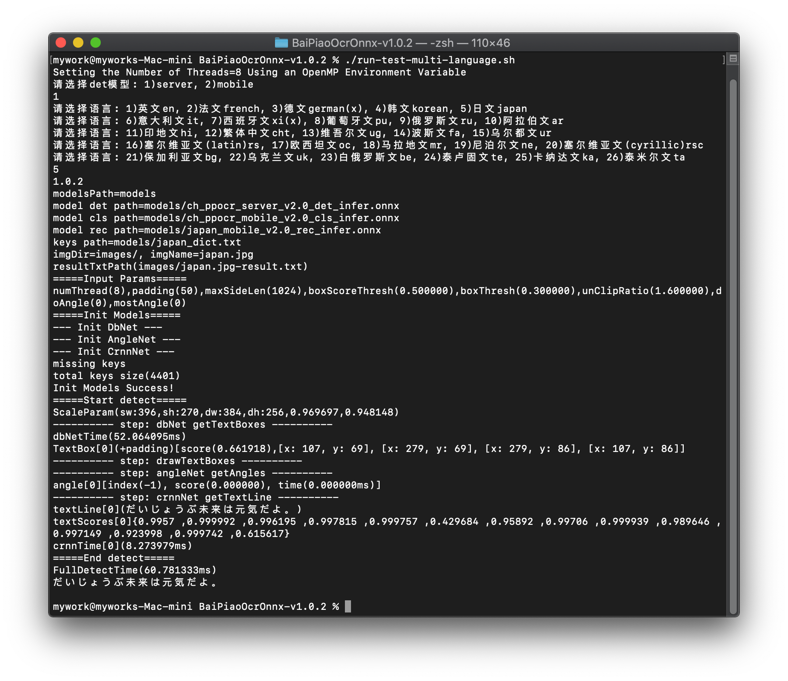

### 简介
为什么要创建这个项目？ 百度paddlepaddle工程化不是太好，为了方便大家在各种端上进行ocr推理，我们将它转换为onnx格式，使用python/c++/java/swift/c# 将它移植到各个平台。

捷智OCR 之名来源于我们所追求的模型： 轻快好省并智能。 基于深度学习技术的OCR技术，主打人工智能优势及小模型，以速度为使命，效果为主导。

基于百度的开源PaddleOCR 模型及训练，任何人可以使用本推理库，也可以根据自己的需求使用百度的paddlepaddle 框架进行模型优化。

### 当前进展
- [x] C++范例(Windows/Linux/macOS): [demo](./cpp)
- [x] Jvm范例(Java/Kotlin): [demo](./jvm)
- [x] .Net范例(C#): [demo](./dotnet)
- [x] Android范例: [demo](./android)
- [x] python范例: [demo](.python)
- [ ] IOS范例: 等待有缘人贡献代码

### [在线演示](http://rapidocr.51pda.cn:9003/)

### [模型训练相关问题](https://github.com/PaddlePaddle/PaddleOCR/blob/release/2.1/doc/doc_ch/FAQ.md)

### 模型转换
- 目前转换脚本支持的模型：文本方向分类模型1个，检测模型2个，识别模型28个(简体中文2种，繁体中文等26种)，合计31个
- [模型转换说明](./models)

### C++/JVM Demo识别展示

### 多国语言识别展示

### .Net Demo识别展示

### 版权声明
- 如果你的产品使用了本仓库中的全部或部分代码、文字或材料
- 请注明出处并包括我们的github url: `https://github.com/RapidOCR/RapidOCR`

### 授权
- OCR模型版权归百度所有，其它工程代码版权归本仓库所有者所有。
- 本软件采用LGPL 授权方式，欢迎大家贡献代码，提交issue 甚至pr.
- 您可以通过QQ群联系到我们： 887298230
- 群号搜索不到时，请直接点此[**链接**](https://jq.qq.com/?_wv=1027&k=P9b3olx6)，找到组织