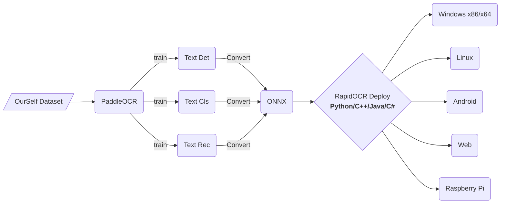

  

# RapidOCR

[简体中文](../README.md) | English

    
    
    
    
    
    
    
    

    
Contents

- [RapidOCR](#rapidocr)
  - [Introduction](#introduction)
  - [Recently updates(more)](#recently-updatesmore)
      - [🧸2022-08-17 update:](#2022-08-17-update)
      - [🕶2022-08-14 update:](#2022-08-14-update)
      - [🎧2022-07-10 update:](#2022-07-10-update)
  - [Overall Framework](#overall-framework)
  - [FAQ](#faq)
  - [SDK compilation status](#sdk-compilation-status)
  - [Online demo](#online-demo)
  - [Directory structure](#directory-structure)
  - [Current Progress](#current-progress)
  - [Model related](#model-related)
      - [Download models(Baidu NetDisk | [Google Drive](https://drive.google.com/drive/folders/1x_a9KpCo_1blxH1xFOfgKVkw1HYRVywY?usp=sharing))](#download-modelsbaidu-netdisk--google-drive)
      - [Model to onnx](#model-to-onnx)
    - [Compared](#compared)
      - [Text Det](#text-det)
      - [Text Recognition](#text-recognition)
  - [Original initiator and start-up author](#original-initiator-and-start-up-author)
  - [Acknowledgements](#acknowledgements)
  - [Sponsor](#sponsor)
  - [Authorization](#authorization)
  - [Contact us](#contact-us)
  - [Demo](#demo)
      - [Demonstration with C++/JVM](#demonstration-with-cjvm)
      - [Demonstration with .Net](#demonstration-with-net)
      - [Demonstratioin with multi_language](#demonstratioin-with-multi_language)

## Introduction
- Completely open source, free and support offline deployment of multi-platform and multi-language OCR SDK
- **Chinese Advertising**: Welcome to join our QQ group to download the model and test program, QQ group number: 887298230
- **Cause**: Baidu paddlepaddle engineering is not very good, in order to facilitate everyone to perform OCR reasoning on various terminals, we convert it to onnx format, use `Python/C++/Java/Swift/C#' to change It is ported to various platforms.

- **Name Source**: Light, fast, economical and smart. OCR technology based on deep learning technology focuses on artificial intelligence advantages and small models, with speed as the mission and effect as the leading role.

- Based on Baidu's open source PaddleOCR model and training, anyone can use this inference library, or use Baidu's paddlepaddle framework for model optimization according to their own needs.

## Recently updates([more](./change_log_en.md))
#### 🧸2022-08-17 update:
- The python/ocrweb part v1.1.0 is released, see the [link]((https://github.com/RapidAI/RapidOCR/releases/tag/v1.1.0)) for details.

#### 🕶2022-08-14 update:
- The ocrweb part adds the function of deploying calls by API, and you can send POST requests to get OCR recognition results.
- For details, see: [API deploy](../ocrweb/README.md#以api方式运行和调用)

#### 🎧2022-07-10 update:
- Add test case for onnxruntime-gpu → [link](../python/README.md#onnxruntime-gpu version inference configuration)
- Add benchamark test set → [link](../images/README.md)
- Add actions to automatically publish whl packages, when modifying python/rapidocr_onnxruntime, it will automatically update the published whl packages. See [WHL README](../docs/doc_whl_en.md)

## Overall Framework

## [FAQ](./doc/FAQ.md)

## SDK compilation status
Since ubuntu users are all commercial users and have the ability to compile, pre-compiled packages are not provided for the time being, and they can be compiled by themselves.

| Platform | Compilation Status | Offer Status |
| --------------- | -------- | -------- |
| Windows x86/x64 |  | [Download Link](https://github.com/RapidAI/RapidOCR/releases) |
| Linux x64 |  | Not available yet, compile by yourself |

## [Online demo](http://rapidocr.51pda.cn:9003/)
- The model combination (optimal combination) used for the demo is: `ch_PP-OCRv3_det + ch_ppocr_mobile_v2.0_cls + ch_PP-OCRv3_rec`
- Environment: `4 Core AMD EPYC 7K62 48-Core Processor `
- **Gif Demo**:
    

        
    

## Directory structure

    
click to expand

    RapidOCR
        ├── android         # Android project directory
        ├── api4cpp         # C language cross-platform interface library source code directory, directly compile with CMakelists.txt under the root
        ├── assets          # Some pictures for demonstration, not a test set
        ├── commonlib       # common library
        ├── cpp             # C++-based project folder
        ├── docs            # some docs
        ├── dotnet          # .Net program directory
        ├── images          # Test pictures, two typical test pictures, one is a natural scene, the other is a long text
        ├── include         # The header file directory when compiling the c language interface library
        ├── ios             # Apple mobile phone platform project directory
        ├── jvm             # java-based project directory
        ├── lib             # Compilation library file directory, used to compile the C language interface library. Binary files are not uploaded by default
        ├── ocrweb          # Based on python and Flask web
        ├── python          # python reasoning code directory
        ├── release         #
        └── tools           # Some conversion scripts and the like

## Current Progress
- [x] C++ example (Windows/Linux/macOS): [demo](../cpp)
- [x] Jvm example (Java/Kotlin): [demo](../jvm)
- [x] .Net example (C#): [demo](../dotnet)
- [x] Android example: [demo](../android)
- [x] python example: [demo](../python)
- [ ] IOS example: waiting for someone to contribute code
- [ ] Rewrite the C++ reasoning code according to the python version to improve the reasoning effect, and add support for gif/tga/webp format pictures

## Model related
#### Download models([Baidu NetDisk](https://pan.baidu.com/s/1mkirNltJS481In4g81jP3w?pwd=zy37) | [Google Drive](https://drive.google.com/drive/folders/1x_a9KpCo_1blxH1xFOfgKVkw1HYRVywY?usp=sharing))

#### Model to onnx
   - [PaddleOCRModelConverter](https://github.com/RapidAI/PaddleOCRModelConverter) by @[SWHL](https://github.com/SWHL)
   - [Paddle2OnnxConvertor](https://github.com/RapidAI/Paddle2OnnxConvertor) by @[benjaminwan](https://github.com/benjaminwan)
   - [Teach you to use ONNXRunTime to deploy PP-OCR](https://aistudio.baidu.com/aistudio/projectdetail/1479970?channelType=0&channel=0) by @[Channingss](https://github.com/Channingss)

### Compared
#### Text Det
- test dataset: `Chinese and English (111, including cards, documents and natural images)`

|                Model                  | infer_Speed(s/img) | precision | recall | hmean  | Model Size |
| :---------------------------------: | :----------------: | :-------: | :----: | :----: | :------: |
| ch_ppocr_mobile_v2.0_det_infer.onnx |     0.4345742      |  0.7277   | 0.8413 | 0.7785 |   2.3M   |
|     ch_PP-OCRv2_det_infer.onnx      |     0.5116553      |  0.7817   | 0.8472 | 0.8123 |   2.3M   |
|     ch_PP-OCRv3_det_infer.onnx      |     0.5723512      |  **0.7740**   | **0.8837** | **0.8237** |   2.4M   |

#### Text Recognition
- test dataset: `Chinese and English (168)`

|                Model                 | infer_speed(s/img)   | Score     |    Exact_Match   |   Char_Match | Model Size |
| :---------------------------------: | ------------------: | :-------: | :--------------: | :-------------: | :--: |
| ch_ppocr_mobile_v2.0_rec_infer.onnx |       0.0111        |  **0.7287**   |      **0.5595**      |     0.8979      | 4.3M |
|     ch_PP-OCRv2_rec_infer.onnx      |       0.0193        |  0.6955   |      0.4881      |     **0.9029**      | 8.0M |
|     ch_PP-OCRv3_rec_infer.onnx      |       0.0145        |  0.5537   |      0.3274      |     0.7800      |  11M |
| ch_PP-OCRv3_rec_train_student.onnx  |       0.0157        |  0.5537   |      0.3274      |     0.7800      | 11M  |
| ch_PP-OCRv3_rec_train_teacher.onnx  |       0.0140        |  0.5381   |      0.3095      |     0.7667      | 11M  |

## Original initiator and start-up author

    
    
    

## Acknowledgements
- Many thanks to [DeliciaLaniD](https://github.com/DeliciaLaniD) for fixing the misplaced start position of scan animation in ocrweb.
- Many thanks to [zhsunlight](https://github.com/zhsunlight) for the suggestion about parameterized call GPU reasoning and the careful and thoughtful testing.
- Many thanks to [lzh111222334](https://github.com/lzh111222334) for fixing some bugs of rec preprocessing under python version.
- Many thanks to [AutumnSun1996](https://github.com/AutumnSun1996) for the suggestiong in the [#42](https://github.com/RapidAI/RapidOCR/issues/42).

## Sponsor

|Sponsor|Applied Products|
|:---:|:---:|
|||
|| - |

- If you want to sponsor the project, you can directly click the Sponsor button at the top of the current page, please write a note (e.g. your github account name) to facilitate adding to the sponsorship list above.

## Authorization
- The copyright of the OCR model belongs to Baidu, and the copyright of other engineering codes belongs to the owner of this warehouse.
- This software is licensed under LGPL. You are welcome to contribute code, submit an issue or even pr.

## Contact us
- You can contact us through QQ group: **887298230**
- If you can’t find the group number, please click here [**link**](https://jq.qq.com/?_wv=1027&k=P9b3olx6) to find the organization
- Scan the following QR code with QQ:

    

        
     

## Demo
#### Demonstration with C++/JVM

    

#### Demonstration with .Net

    

#### Demonstratioin with multi_language

    

