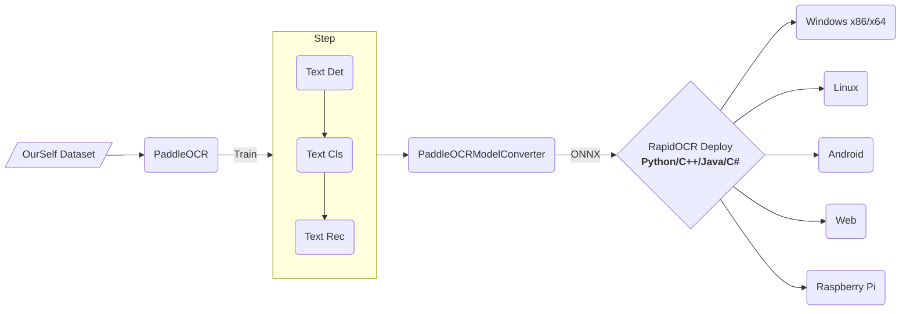

  

# RapidOCR (Open source OCR for the security of the digital world)

[简体中文](https://github.com/RapidAI/RapidOCR/blob/main/README.md) | English

    
    
    
     
    <a href="">=3.7,<=3.10-aff.svg"></a>
    
    
    
    
    
    

    
Contents

- [RapidOCR (Open source OCR for the security of the digital world)](#rapidocr-open-source-ocr-for-the-security-of-the-digital-world)
  - [Introduction](#introduction)
  - [Navigation](#navigation)
  - [Recently updates(more)](#recently-updatesmore)
      - [🎮2023-03-11 v1.2.2 update:](#2023-03-11-v122-update)
      - [🧢2023-03-07 v1.2.1 update:](#2023-03-07-v121-update)
      - [⛸ 2023-02-16 update:](#-2023-02-16-update)
  - [Overall Framework](#overall-framework)
  - [Demo](#demo)
  - [TODO](#todo)
  - [Original initiator and start-up author](#original-initiator-and-start-up-author)
  - [Acknowledgements](#acknowledgements)
  - [Sponsor](#sponsor)
  - [Authorization](#authorization)
  - [Join us](#join-us)
  - [Demo](#demo-1)
      - [Demonstration with C++/JVM](#demonstration-with-cjvm)
      - [Demonstration with .Net](#demonstration-with-net)
      - [Demonstratioin with multi\_language](#demonstratioin-with-multi_language)

## Introduction
- Completely open source, free and support offline deployment of multi-platform and multi-language OCR.
- **Chinese Advertising**: Welcome to join our QQ group to download the model and test program, QQ group number: 887298230
- **Cause**: Baidu paddlepaddle engineering is not very good, in order to facilitate everyone to perform OCR reasoning on various terminals, we convert it to onnx format, use `Python/C++/Java/Swift/C#` to change It is ported to various platforms.

- **Name Source**: Light, fast, economical and smart. OCR technology based on deep learning technology focuses on artificial intelligence advantages and small models, with speed as the mission and effect as the leading role.

- Based on Baidu's open source PaddleOCR model and training, anyone can use this inference library, or use Baidu's PaddlePaddle framework for model optimization according to their own needs.

## Navigation
- [Python demo](https://github.com/RapidAI/RapidOCR/blob/main/python/README.md)
  - [rapidocr_openvino](https://github.com/RapidAI/RapidOCR/blob/main/python/rapidocr_openvino/README.md)
- [C++ demo(Windows/Linux/macOS)](https://github.com/RapidAI/RapidOCR/blob/main/cpp)
  - [RapidOcrOnnx](https://github.com/RapidAI/RapidOcrOnnx)
  - [RapidOcrNcnn](https://github.com/RapidAI/RapidOcrNcnn)
- [Jvm demo(Java/Kotlin)](https://github.com/RapidAI/RapidOCR/blob/main/jvm)
  - [RapidOcrOnnxJvm](https://github.com/RapidAI/RapidOcrOnnxJvm)
  - [RapidOcrNcnnJvm](https://github.com/RapidAI/RapidOcrNcnnJvm)
- [.Net demo(C#)](https://github.com/RapidAI/RapidOCR/blob/main/dotnet)
- [Android demo](https://github.com/RapidAI/RapidOcrAndroidOnnx)
- Web demo:
  - [Web OCR](https://github.com/RapidAI/RapidOCR/blob/main/ocrweb/README.md)
  - [Multi Web OCR](https://github.com/RapidAI/RapidOCR/blob/main/ocrweb_multi/README.md)
- [Structure](https://github.com/RapidAI/RapidOCR/blob/main/python/rapid_structure/README.md)
  - [orientation](https://github.com/RapidAI/RapidOCR/blob/main/python/rapid_structure/docs/README_Orientation.md)
  - [layout](https://github.com/RapidAI/RapidOCR/blob/main/python/rapid_structure/docs/README_Layout.md)
  - [table recovery](https://github.com/RapidAI/RapidOCR/blob/main/python/rapid_structure/docs/README_Table.md)
- Derivatives
  - [RapidOCR HTTP service/win32 program/easy language writing](https://github.com/Physton/RapidOCRServer)
- [Related projects](https://github.com/RapidAI/RapidOCR/blob/main/docs/related_projects.md)
  - [RapidVideOCR](https://github.com/SWHL/RapidVideOCR): Extract hard subtitles in videos based on RapidOCR
  - [LGPMA_Infer](https://github.com/SWHL/LGPMA_Infer): table structure restoration | [blog interpretation papers and source code](http://t.csdn.cn/QNN3S)
  - [Document Unwarping-PaperEdge](https://github.com/cvlab-stonybrook/PaperEdge) | [Demo](https://huggingface.co/spaces/SWHL/PaperEdgeDemo)
  - [Text Removal-CTRNet](https://github.com/lcy0604/CTRNet) | [Demo](https://huggingface.co/spaces/SWHL/CTRNetDemo)
- Model Convert
   - [PaddleOCRModelConverter](https://github.com/RapidAI/PaddleOCRModelConverter)
   - [Paddle2OnnxConvertor](https://github.com/RapidAI/Paddle2OnnxConvertor)
   - [Teach you to use ONNXRunTime to deploy PP-OCR](https://aistudio.baidu.com/aistudio/projectdetail/1479970?channelType=0&channel=0)
- [About model](https://github.com/RapidAI/RapidOCR/blob/main/docs/models.md)
  - [Model Convert](https://github.com/RapidAI/RapidOCR/blob/main/docs/models.md#模型转换)
  - [Model Download](https://github.com/RapidAI/RapidOCR/blob/main/docs/models.md#模型下载)
- [FAQ](https://github.com/RapidAI/RapidOCR/blob/main/docs/FAQ.md)

## Recently updates([more](https://github.com/RapidAI/RapidOCR/blob/main/docs/change_log_en.md))
#### 🎮2023-03-11 v1.2.2 update:
- Fix the incoming parameter error of RapidOCR class in instantiation python

#### 🧢2023-03-07 v1.2.1 update:
- `rapidocr` series package updated to `v1.2.0`
- Optimize the interface input parameters of the rapidocr series package under python, and support the dynamic setting of each parameter when instantiating a class, which is more flexible.
- If not specified, the default parameters under `config.yaml` will be used.
- For details, please refer to: [Input parameters](https://github.com/RapidAI/RapidOCR/blob/0a603b4e8919386f3647eca5cdeba7620b4988e0/python/README.md#%E6%8E%A8%E8%8D%90pip%E5%AE%89%E8%A3%85%E5%BF%AB%E9%80%9F%E4%BD%BF%E7%94%A8)

#### ⛸ 2023-02-16 update:
- Optimize some codes of ocrweb, which can be directly installed by pip and used quickly. For details, please refer to [README](https://github.com/RapidAI/RapidOCR/blob/main/ocrweb/README.md).
- Optimize the inference code of each part in python, which is more compact and easy to maintain.

## Overall Framework

## Demo
- [Online demo](https://rapidai.deepdatasec.com:9003/)
    - If the demo fails, you can visit the demo on Hugging Face: [RapidOCRDemo](https://huggingface.co/spaces/SWHL/RapidOCRDemo)
    - **Note**: This online demo does not store any image data uploaded and tested by friends. For details, please refer to: [ocrweb/README](https://github.com/RapidAI/RapidOCR/blob/main/ocrweb/README.md)
    - The model combination (optimal combination) used for the demo is: `ch_PP-OCRv3_det + ch_ppocr_mobile_v2.0_cls + ch_PP-OCRv3_rec`
    - Environment: `4 Core AMD EPYC 7K62 48-Core Processor `
    - **Gif Demo**:
        

            
        

- [Hugging Face Demo](https://huggingface.co/spaces/SWHL/RapidOCRDemo)
  - The demo is built on Hugging Face's Spaces, generated by the Gradio library, and adds three hyperparameters:
       - `box_thresh`: The probability that the detected box is text, the larger the value, the higher the probability that the box is text.
       - `unclip_ratio`: Controls the size of the detected text box, the larger the value, the larger the detection box as a whole.
       - `text_score`: The confidence that the text recognition result is correct, the larger the value, the more accurate the displayed recognition result.
  - Demo:
    

        
    

## TODO
- [ ] iOS example: waiting for someone to contribute code
- [ ] Rewrite the C++ reasoning code according to the python version to improve the reasoning effect, and add support for gif/tga/webp format pictures

## Original initiator and start-up author

    
    
    

## Acknowledgements
- Many thanks to [DeliciaLaniD](https://github.com/DeliciaLaniD) for fixing the misplaced start position of scan animation in ocrweb.
- Many thanks to [zhsunlight](https://github.com/zhsunlight) for the suggestion about parameterized call GPU reasoning and the careful and thoughtful testing.
- Many thanks to [lzh111222334](https://github.com/lzh111222334) for fixing some bugs of rec preprocessing under python version.
- Many thanks to [AutumnSun1996](https://github.com/AutumnSun1996) for the suggestion in the [#42](https://github.com/RapidAI/RapidOCR/issues/42).

## Sponsor

|Sponsor|Applied Products|
|:---:|:---:|
|||
|| - |

- If you want to sponsor the project, you can directly click the Sponsor button at the top of the current page, please write a note (e.g. your github account name) to facilitate adding to the sponsorship list above.

## Authorization
- The copyright of the OCR model belongs to Baidu, and the copyright of other engineering codes belongs to the owner of this warehouse.
- This software is licensed under LGPL. You are welcome to contribute code, submit an issue or even PR.

## Join us
- For international developers, we regard [RapidOCR Disscussions](https://github.com/RapidAI/RapidOCR/discussions) as our international community platform. All ideas and questions can be discussed here in English.

## Demo
#### Demonstration with C++/JVM

    

#### Demonstration with .Net

    

#### Demonstratioin with multi_language

    

