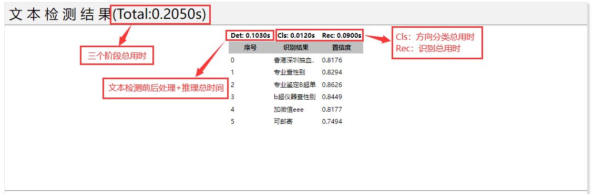

## RapidOCR Web Demo

- [RapidOCR Web Demo](#rapidocr-web-demo)
  - [简要说明](#简要说明)
  - [config.yaml全局参数说明](#configyaml全局参数说明)
  - [以Web方式运行](#以web方式运行)
  - [以API方式运行](#以api方式运行)


### 简要说明
- 所用模型组合（最优组合）为：
  ```text
  ch_PP-OCRv3_det + ch_ppocr_mobile_v2.0_cls + ch_PP-OCRv3_rec
  ```
- **运行机器配置:** `4核 AMD EPYC 7K62 48-Core Processor`
- 所有相关参数配置参见当前目录下的[`config.yaml`](./config.yaml)，具体参数解释参见[Link](https://github.com/RapidAI/RapidOCR/blob/main/python/README.md#configyaml%E4%B8%AD%E5%B8%B8%E7%94%A8%E5%8F%82%E6%95%B0%E4%BB%8B%E7%BB%8D)。
- 网页上显示的推理时间具体解释如下：
    <div align="center">
        
    </div>

### config.yaml全局参数说明
- 详情参见：[README](../python/README.md#configyaml中常用参数介绍)


### 以Web方式运行
1. 安装`requirements.txt`下相关包
    ```shell
    pip install -r requirements.txt -i https://pypi.douban.com/simple/
    ```
2. 下载`models`目录
    - 下载链接：[百度网盘](https://pan.baidu.com/s/1PTcgXG2zEgQU6A_A3kGJ3Q?pwd=jhai) | [Google Drive](https://drive.google.com/drive/folders/1x_a9KpCo_1blxH1xFOfgKVkw1HYRVywY?usp=sharing)
    - 最终目录结构如下：
        ```text
        ocrweb
        ├── README.md
        ├── main.py
        ├── requirements.txt
        ├── task.py
        ├── rapidocr_onnxruntime
        │   ├── __init__.py
        │   ├── ch_ppocr_v3_det
        │   ├── ch_ppocr_v2_cls
        │   ├── ch_ppocr_v3_rec
        │   ├── config.yaml
        │   ├── rapid_ocr_api.py
        │   └── models
        │       ├── ch_PP-OCRv3_det_infer.onnx
        │       ├── ch_ppocr_mobile_v2.0_cls_infer.onnx
        │       └── ch_PP-OCRv3_rec_infer.onnx
        ├── static
        │   ├── css
        │   └── js
        └── templates
            └── index.html
        ```

3. 运行`main.py`
    ```shell
    $ python main.py
    ```
4. 打开`http://0.0.0.0:9003/`即可， enjoy it!

### 以API方式运行
1. 同**以Web方式运行**中步骤1
2. 同**以Web方式运行**中步骤2
3. 运行`api.py`
   ```python
   $ python api.py
   ```

4. 发送post请求，调用
    ```python
    import ast
    import base64
    import json

    import requests


    def get_json_format(img_path):
        with open(img_path, 'rb') as f:
            img_byte = base64.b64encode(f.read())
        img_json = json.dumps({'file': img_byte.decode('ascii')})
        return img_json


    if __name__ == '__main__':
        url = 'http://localhost:9003/ocr'
        header = {'Content-Type': 'application/json; charset=UTF-8'}

        img_path = '../images/1.jpg'
        img_json = get_json_format(img_path)

        response = requests.post(url, data=img_json, headers=header)
        if response.status_code == 200:
            rec_res = ast.literal_eval(response.text)
            print(rec_res)
        else:
            print(response.status_code)
    ```

5. 输出以下结果，即为正确。
   ```text
    [
        [[[265.0, 18.0], [472.0, 231.0], [431.0, 271.0], [223.0, 59.0]], '香港深圳抽血', 0.8021483932222638],
        [[[388.0, 15.0], [636.0, 257.0], [587.0, 307.0], [339.0, 65.0]], '专业查性别', 0.7488822937011719],
        [[[215.0, 84.0], [509.0, 413.0], [453.0, 463.0], [159.0, 134.0]], '专业鉴定B超单', 0.8711239919066429],
        [[[128.0, 135.0], [430.0, 478.0], [366.0, 534.0], [64.0, 192.0]], 'b超仪器查性别', 0.8705329671502113],
        [[[58.0, 189.0], [268.0, 450.0], [209.0, 498.0], [0.0, 236.0]], '加微信eee', 0.8492027946880886],
        [[[493.0, 261.0], [617.0, 384.0], [577.0, 423.0], [454.0, 300.0]], '可邮寄', 0.7494295984506607]
    ]
   ```
   - 输出结果说明：
     - 如果图像中存在文字，则会输出`list`类型，具体格式介绍如下：
          ```text
          [
              # 坐标为左上角 → 右上角 → 右下角 → 左下角
              [[[left, top], [right, top], [right, bottom], [left, bottom]], 识别文本, 置信度]
          ]
          ```
     - 如果没有检测到文字，则会输出空列表(`[]`)。
6. **!!说明：OCR的输出结果为最原始结果，大家可按需进一步扩展。**
