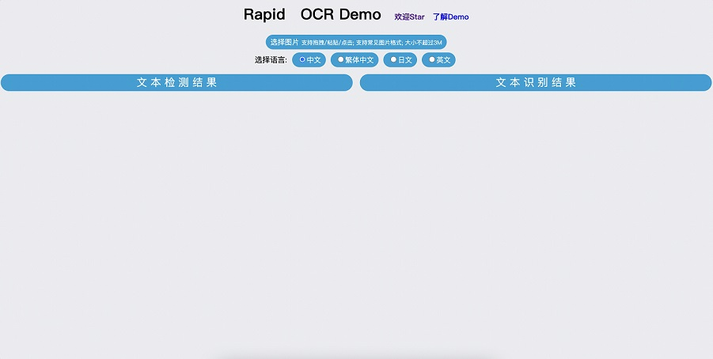

## RapidOCR Multilanguage Web Demo

### 简要说明
- 同时支持多种语言，可通过接口参数配置语言及预测过程中的其他参数
- 调整结果展示方式为基于canvas, 减少后端处理和接口数据传输
- 预测接口添加Token验证支持
- 添加pyinstaller打包脚本，简化安装步骤
- 示例打包结果：[pyinstaller demo](https://github.com/AutumnSun1996/RapidOCR/releases/tag/v1.1.1-ocrweb-multi)

### 运行步骤
1. 安装`requirements.txt`下相关包
    ```shell
    pip install -r requirements.txt -i https://pypi.douban.com/simple/
    ```
2. 下载`models`文件到当前目录下
    - 下载链接：[百度网盘](https://pan.baidu.com/s/1Z3v34wu0tE6lBndYyP0xOg?pwd=6urq) | [Google Drive](https://drive.google.com/drive/folders/1HZUzGplq_47xKmDVtplwrMmIjoHm7uKo?usp=sharing)
    - 最终目录结构如下：
      ```text
        ocr_web_multi
          |-- README.md
          |-- build.py
          |-- config.yaml
          |-- main.py
          |-- main.spec
          |-- models
          |   |-- Multilingual_PP-OCRv3_det_infer.onnx
          |   |-- ch_PP-OCRv3_det_infer.onnx
          |   |-- ch_PP-OCRv3_rec_infer.meta.onnx
          |   |-- ch_ppocr_mobile_v2.0_cls_infer.meta.onnx
          |   |-- chinese_cht_PP-OCRv3_rec_infer.meta.onnx
          |   |-- en_PP-OCRv3_det_infer.onnx
          |   |-- en_PP-OCRv3_rec_infer.meta.onnx
          |   `-- japan_PP-OCRv3_rec_infer.meta.onnx
          |-- rapidocr
          |   |-- __init__.py
          |   |-- classify.py
          |   |-- detect.py
          |   |-- detect_process.py
          |   |-- main.py
          |   |-- rapid_ocr_api.py
          |   `-- recognize.py
          |-- requirements.txt
          |-- static
          |   |-- css
          |   |-- favicon.ico
          |   |-- hint.svg
          |   |-- index.html
          |   `-- js
          |-- utils
          |   |-- config.py
          |   `-- utils.py
          |-- wrapper.c
          `-- wrapper.rc
      ```
3. 运行`main.py`
    ```shell
    python main.py
    ```
4. 打开`http://127.0.0.1:8001`即可， enjoy it!

   