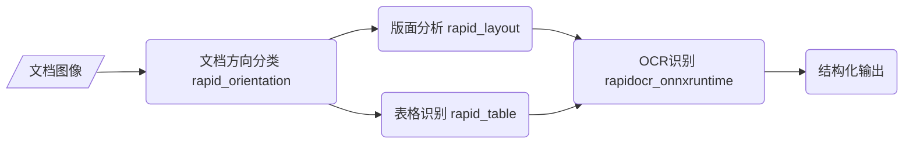

## Rapid Structure
- 该部分的功能主要针对文档类图像，包括文档图像分类、版面分析和表格识别。

### [版面分析](https://github.com/RapidAI/RapidOCR/blob/main/python/rapid_structure/docs/README_Layout.md)

### [表格识别](https://github.com/RapidAI/RapidOCR/blob/main/python/rapid_structure/docs/README_Table.md)

### [文档方向分类](https://github.com/RapidAI/RapidOCR/blob/main/python/rapid_structure/docs/README_Orientation.md)

### 整体结构
