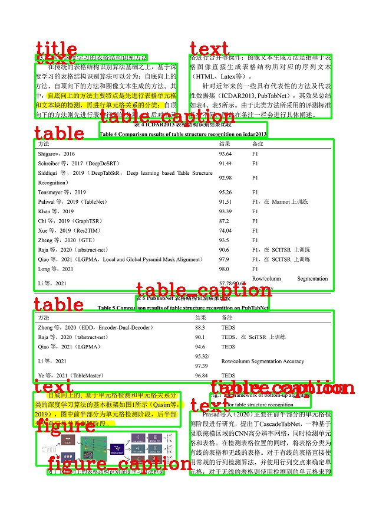

## Rapid Layout
<p align="left">
    <a href="">=3.7,<=3.10-aff.svg"></a>
    <a href=""></a>
    <a href="https://pypi.org/project/rapid-layout/"></a>
    <a href="https://pypi.org/project/rapid-layout/"></a>
</p>

##### 简介和说明
- 该部分主要是做文档类图像的版面分析。
- 具体来说，就是分析给定的文档类别图像（论文截图等），定位其中类别和位置，如标题、段落、表格和图片等各个部分。
- 目前支持三种类别的版面分析模型：中文、英文和表格版面分析模型，具体可参见下面表格：

    | 模型类型  |        模型名称         | 模型大小 |                           支持种类                           |
    |:---:|:---:|:---:|:---:|
    |   表格   |   `layout_table.onnx`   |  7.06M   |                           `table`                            |
    |   英文   | `layout_publaynet.onnx` |  7.06M   |                `text title list table figure`                |
    |   中文   |   `layout_cdla.onnx`    |  7.07M   | `text title figure  figure_caption table table_caption` <br> `header footer reference equation` |
- 模型下载地址为：[百度网盘](https://pan.baidu.com/s/1PI9fksW6F6kQfJhwUkewWg?pwd=p29g) | [Google Drive](https://drive.google.com/drive/folders/1DAPWSN2zGQ-ED_Pz7RaJGTjfkN2-Mvsf?usp=sharing)

#### 使用方式
1. pip安装
   - 由于模型较小，预先将中文版面分析模型(`layout_cdla.onnx`)打包进了whl包内，如果做中文版面分析，可直接安装使用
        ```bash
        $ pip install rapid-layout
        ```
2. python脚本运行
   ```python
    import cv2
    from rapid_layout import RapidLayout

    # RapidLayout类提供model_path参数，可以自行指定上述3个模型，默认是layout_cdla.onnx
    # layout_engine = RapidLayout(model_path='layout_publaynet.onnx')
    layout_engine = RapidLayout()

    img = cv2.imread('test_images/layout.png')

    layout_res, elapse = layout_engine(img)
   ```

3. 终端运行
   - 用法:
       ```bash
       $ rapid_layout -h
       usage: rapid_layout [-h] [-v] -img IMG_PATH [-m MODEL_PATH]

       optional arguments:
       -h, --help            show this help message and exit
       -v, --vis             Wheter to visualize the layout results.
       -img IMG_PATH, --img_path IMG_PATH
                               Path to image for layout.
       -m MODEL_PATH, --model_path MODEL_PATH
                               The model path used for inference.
       ```
   - 示例:
       ```bash
       $ rapid_layout -v -img layout.png
       ```

4. 结果
    - 返回结果
        ```python
        # bbox: [左上角x0,左上角y0, 右下角x0, 右上角x1]
        # label: 类别
        [
            {'bbox': array([321.4160495, 91.53214898, 562.06141263, 199.85522603]), 'label': 'text'},
            {'bbox': array([58.67292211, 107.29000663, 300.25448676, 199.68142]), 'label': 'table_caption'}
        ]
        ```
   - 可视化结果
    <div align="center">
        
    </div>
