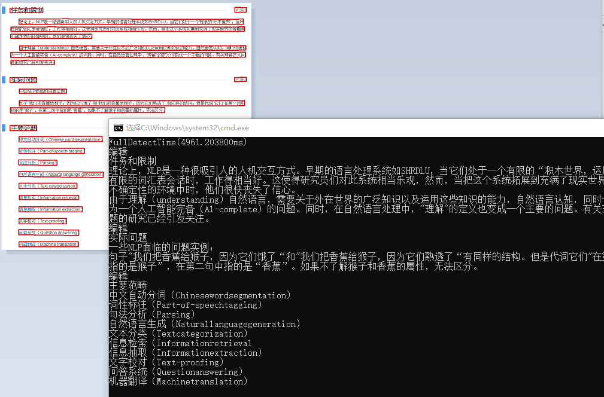
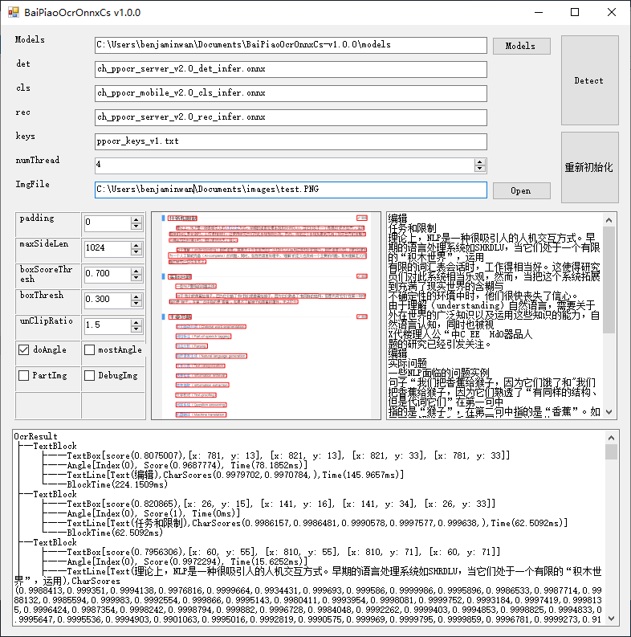

中文广告： 欢迎加入我们的QQ群下载模型及测试程序，qq群号：887298230

征集志愿者编译集成SDK,请进群找群主联系。

访问： [中文版](readme_cn.md)             Chinese Name: 捷智OCR

Note:

For PC (political correctness ), we changed our name from BaiPiaoOCR to RapidOCR


Special thanks to Channingss@baidu (the owner of project Paddle2Onnx)

### Directory structure

### [Click to see 目录结构](dir.md)    


**Copyright announcement:**

If you use or reference code or code snippet from the repository, please add our url 

https://github.com/znsoftm/RapidOCR   in your prodouct derived from the repository.


**Author:**

benjaminwan, znsoftm

All contributors is in the contributor list on the right side of this page.


**Description**

BaiPiaoOCR means an  OCR Engine who is fair-skinned, rich and beautiful from Baidu, it's based on PaddleOCR & OnnxRuntime.

Note： The project is derived from https://github.com/PaddlePaddle/PaddleOCR

We create the project to transfer PaddleOCR's model into the version of Onnx model to deploy the model on almost every devices, such as x86 PC, Android & IOS.

We are using Paddle2ONNX (https://github.com/PaddlePaddle/Paddle2ONNX)  to transform it to Onnx format.


You can visualize the model by https://github.com/lutzroeder/netron/


Welcome to our Group on QQ: 887298230
or visit: https://jq.qq.com/?_wv=1027&k=P9b3olx6 to join us.


Download OCR　models:
```
Linkage ：https://pan.baidu.com/s/1UhDrC7iOMWiYaQiHk3acdw 

code：yjgv 
```
Also you can download demonstration APPs and their projects from our baidu netdisk with the above link.

### Demonstration with C++/JVM



### Demonstration with  .Net


